# Pan-Cyrillic single characters — lowercase

**176** unique lowercase characters across the 77 languages in scope. Of these, **54** are encoded in the Unicode Private Use Area (E000–F8FF). **105** have a composed description (`… WITH …`): **67** are decomposed below into a base character plus one or more combining marks, and **38** are structural modifications (Descender, Hook, Tail, Stroke, Bar, Tick, Upturn, Middle Hook, Vertical Stroke, or the Stroke+Hook pair) that have no standard combining-mark equivalent — those are kept as their codepoint plus the descriptive name.

Decomposition note: the `BREVE` combining mark in Cyrillic rows resolves to `U+F6D1` (uppercase) / `U+F6D4` (lowercase) — the Cyrillic-shaped breve glyphs carried by Paratype Expert fonts — rather than the generic combining breve `U+0306`, whose shape does not match Cyrillic typography.

Codepoints are shown in uppercase hex. Multi-codepoint sequences use `XXXX + XXXX + …` in reading order (base first).

| # | Sign | Codepoint | Description | PUA | Decomposition | Diagram | Locales |
| ---: | :---: | --- | --- | :---: | --- | :---: | --- |
| 1 | ʼ | 02BC | Modifier Letter Apostrophe |  |  | 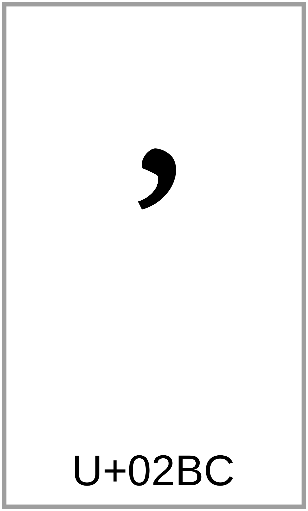 [txt](svg/lc/02BC.txt) | ru |
| 2 | а | 0430 | Cyrillic Small Letter A |  |  |  [txt](svg/lc/0430.txt) | ru |
| 3 | б | 0431 | Cyrillic Small Letter Be |  |  | 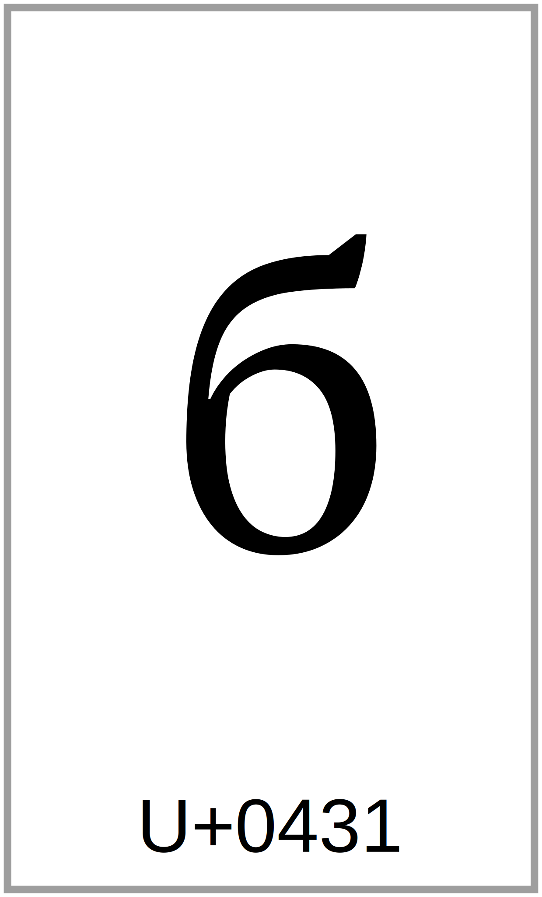 [txt](svg/lc/0431.txt) | ru, sr |
| 4 | в | 0432 | Cyrillic Small Letter Ve |  |  | 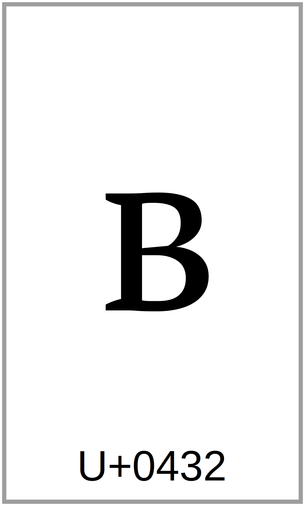 [txt](svg/lc/0432.txt) | bg, ru |
| 5 | г | 0433 | Cyrillic Small Letter Ghe |  |  | 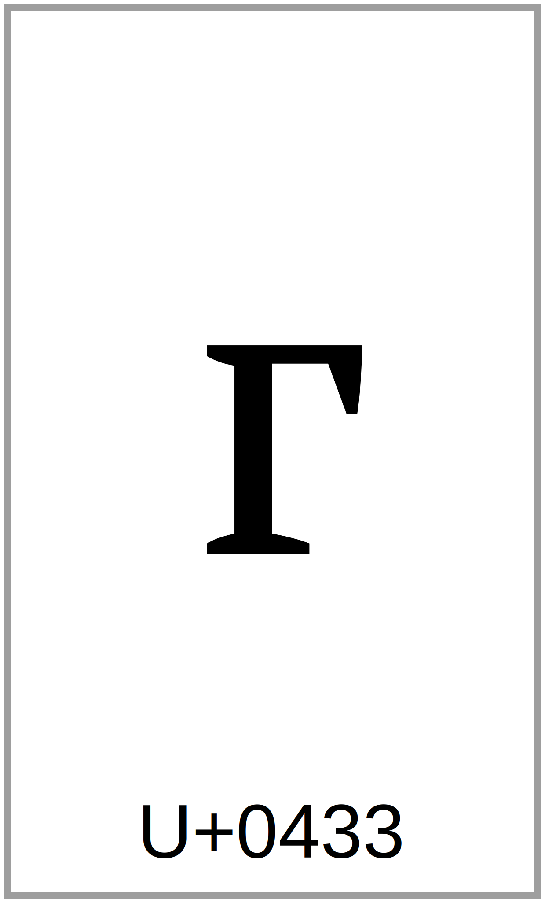 [txt](svg/lc/0433.txt) | bg, ru, sr |
| 6 | д | 0434 | Cyrillic Small Letter De |  |  | 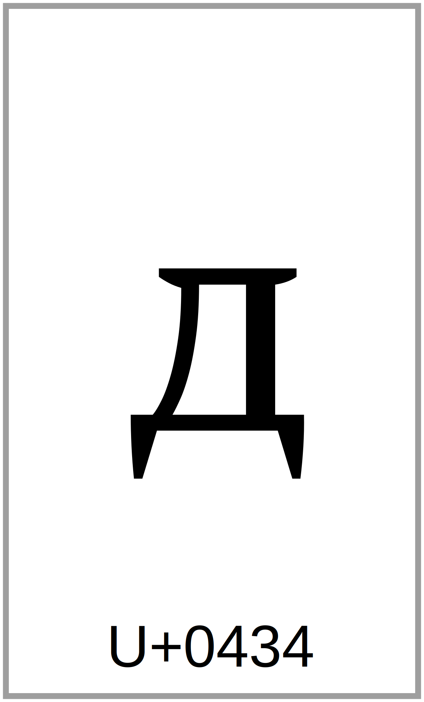 [txt](svg/lc/0434.txt) | bg, ru, sr |
| 7 | е | 0435 | Cyrillic Small Letter Ie |  |  | 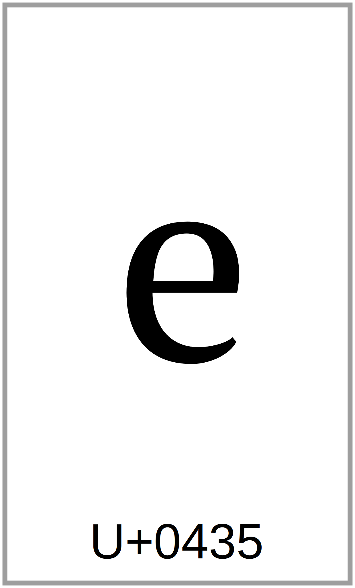 [txt](svg/lc/0435.txt) | ru |
| 8 | ж | 0436 | Cyrillic Small Letter Zhe |  |  |  [txt](svg/lc/0436.txt) | bg, ru |
| 9 | з | 0437 | Cyrillic Small Letter Ze |  |  | 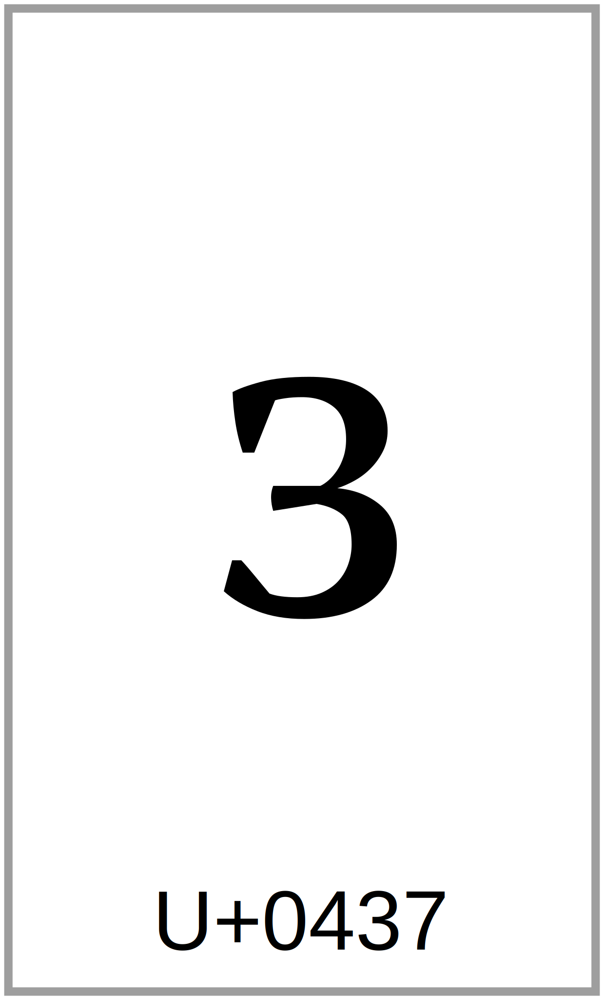 [txt](svg/lc/0437.txt) | bg, ru |
| 10 | и | 0438 | Cyrillic Small Letter I |  |  |  [txt](svg/lc/0438.txt) | bg, ru |
| 11 | й | 0439 | Cyrillic Small Letter Short I |  |  |  [txt](svg/lc/0439.txt) | bg, ru |
| 12 | к | 043A | Cyrillic Small Letter Ka |  |  |  [txt](svg/lc/043A.txt) | bg, ru |
| 13 | л | 043B | Cyrillic Small Letter El |  |  | 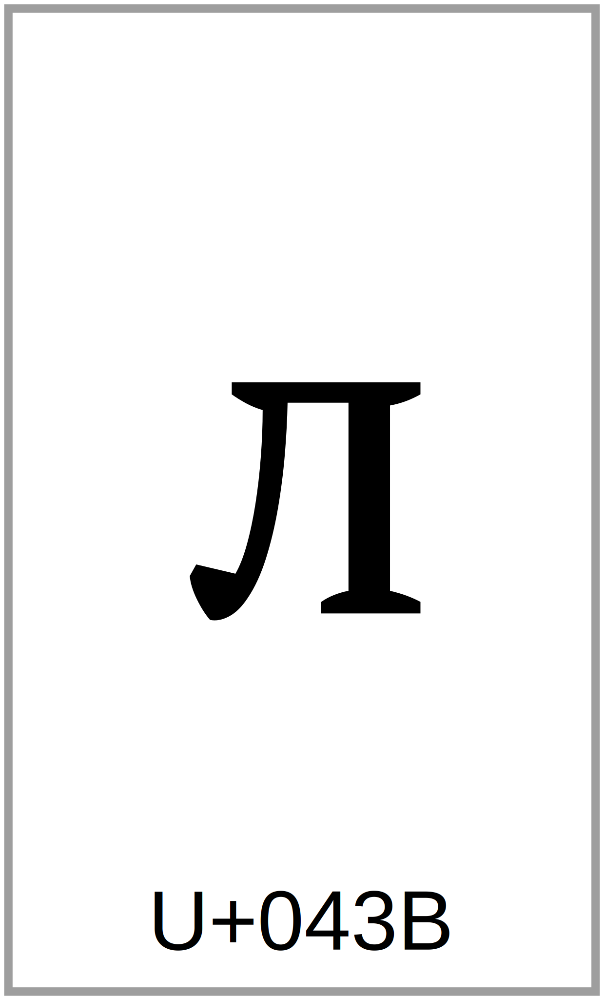 [txt](svg/lc/043B.txt) | bg, ru |
| 14 | м | 043C | Cyrillic Small Letter Em |  |  |  [txt](svg/lc/043C.txt) | ru |
| 15 | н | 043D | Cyrillic Small Letter En |  |  |  [txt](svg/lc/043D.txt) | bg, ru |
| 16 | о | 043E | Cyrillic Small Letter O |  |  |  [txt](svg/lc/043E.txt) | ru |
| 17 | п | 043F | Cyrillic Small Letter Pe |  |  |  [txt](svg/lc/043F.txt) | bg, ru, sr |
| 18 | р | 0440 | Cyrillic Small Letter Er |  |  |  [txt](svg/lc/0440.txt) | ru |
| 19 | с | 0441 | Cyrillic Small Letter Es |  |  |  [txt](svg/lc/0441.txt) | ru |
| 20 | т | 0442 | Cyrillic Small Letter Te |  |  |  [txt](svg/lc/0442.txt) | bg, ru, sr |
| 21 | у | 0443 | Cyrillic Small Letter U |  |  | 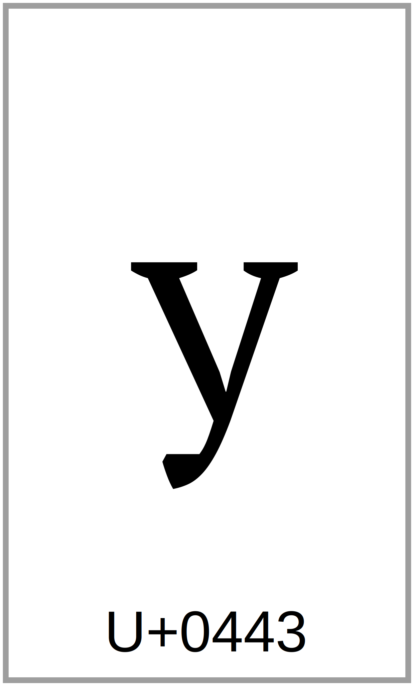 [txt](svg/lc/0443.txt) | ru |
| 22 | ф | 0444 | Cyrillic Small Letter Ef |  |  | 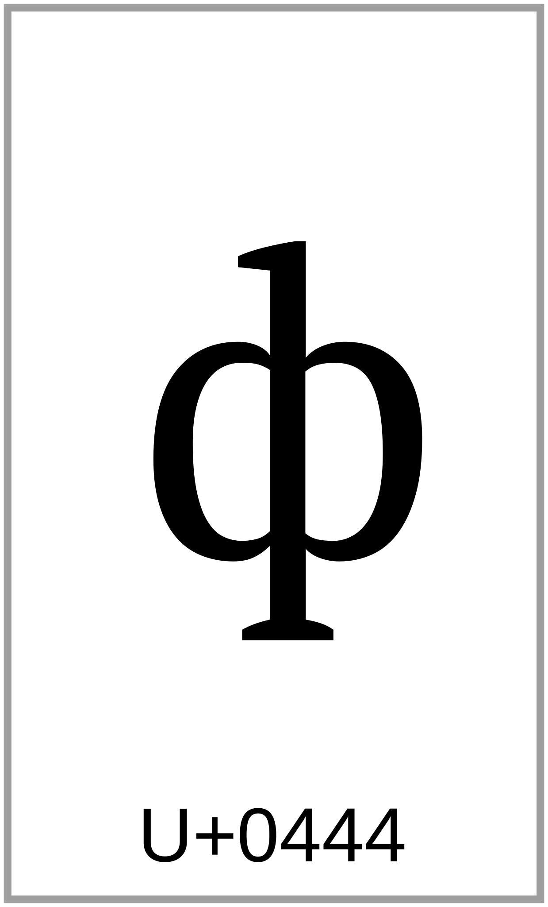 [txt](svg/lc/0444.txt) | ru |
| 23 | х | 0445 | Cyrillic Small Letter Ha |  |  |  [txt](svg/lc/0445.txt) | ru |
| 24 | ц | 0446 | Cyrillic Small Letter Tse |  |  | 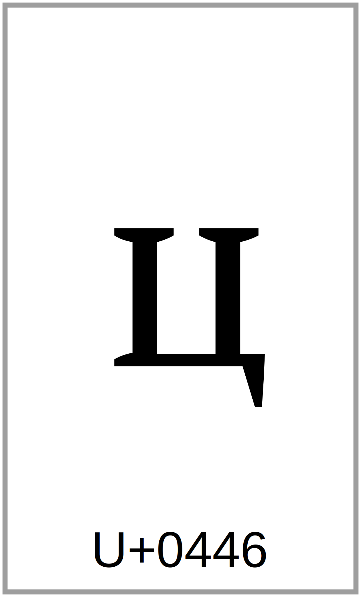 [txt](svg/lc/0446.txt) | bg, ru |
| 25 | ч | 0447 | Cyrillic Small Letter Che |  |  |  [txt](svg/lc/0447.txt) | bg, ru |
| 26 | ш | 0448 | Cyrillic Small Letter Sha |  |  |  [txt](svg/lc/0448.txt) | bg, ru, sr |
| 27 | щ | 0449 | Cyrillic Small Letter Shcha |  |  | 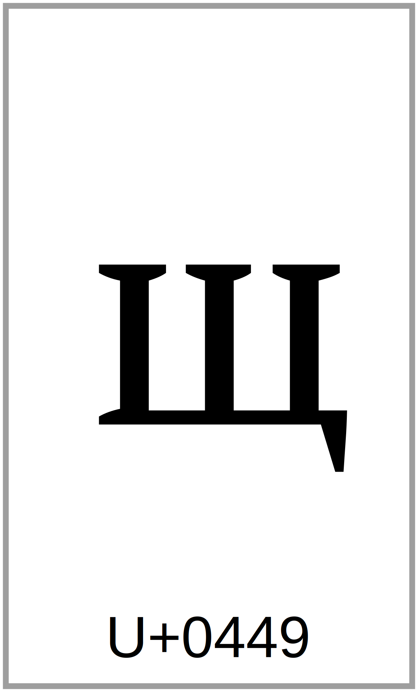 [txt](svg/lc/0449.txt) | bg, ru |
| 28 | ъ | 044A | Cyrillic Small Letter Hard Sign |  |  | 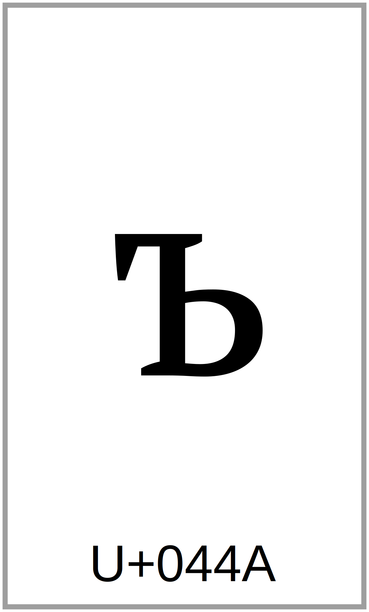 [txt](svg/lc/044A.txt) | bg, ru |
| 29 | ы | 044B | Cyrillic Small Letter Yeru |  |  |  [txt](svg/lc/044B.txt) | ru |
| 30 | ь | 044C | Cyrillic Small Letter Soft Sign |  |  | 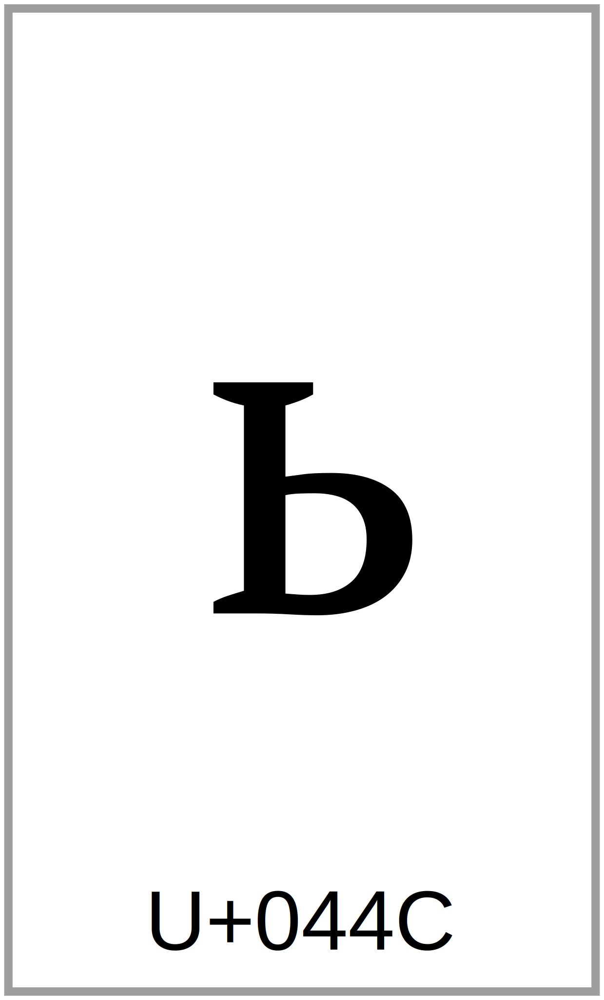 [txt](svg/lc/044C.txt) | bg, ru |
| 31 | э | 044D | Cyrillic Small Letter E |  |  | 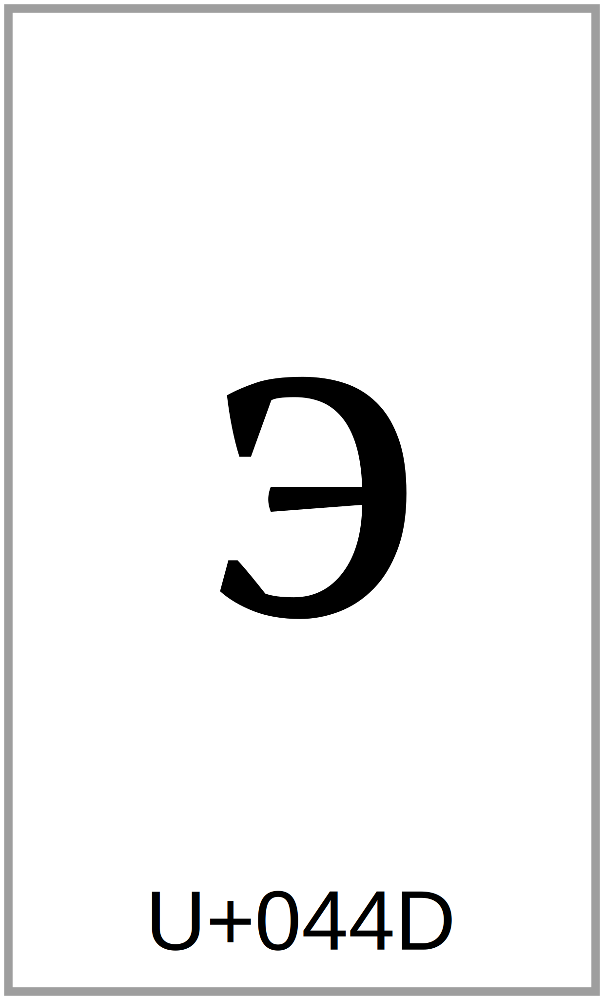 [txt](svg/lc/044D.txt) | ru |
| 32 | ю | 044E | Cyrillic Small Letter Yu |  |  |  [txt](svg/lc/044E.txt) | bg, ru |
| 33 | я | 044F | Cyrillic Small Letter Ya |  |  |  [txt](svg/lc/044F.txt) | ru |
| 34 | ѐ | 0450 | Cyrillic Small Letter Ie With Grave |  | 0435 + 0300 |  [txt](svg/lc/0450.txt) | ru |
| 35 | ё | 0451 | Cyrillic Small Letter Io |  |  |  [txt](svg/lc/0451.txt) | ru |
| 36 | ђ | 0452 | Cyrillic Small Letter Dje |  |  | 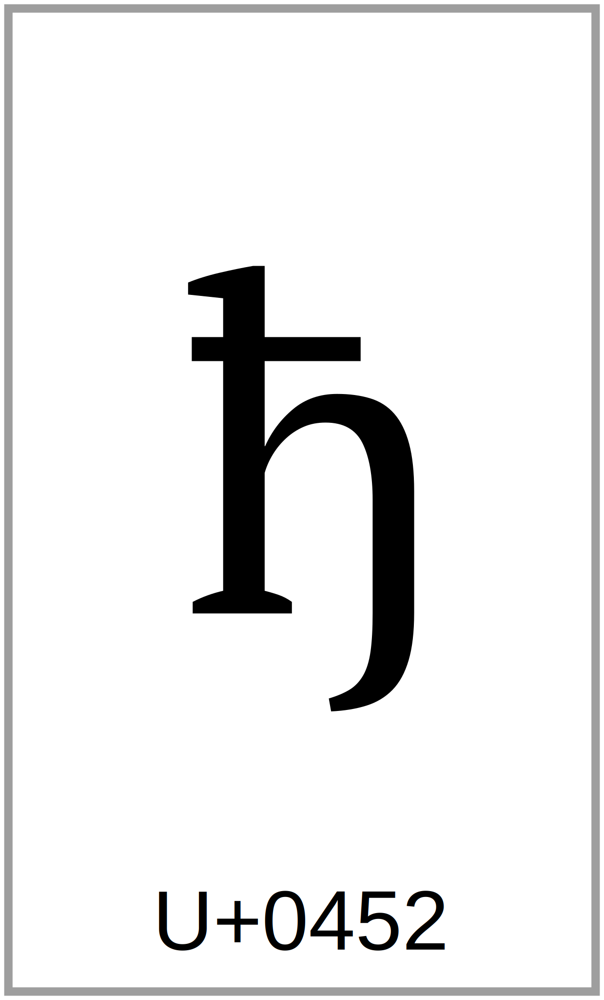 [txt](svg/lc/0452.txt) | ru |
| 37 | ѓ | 0453 | Cyrillic Small Letter Gje |  |  | 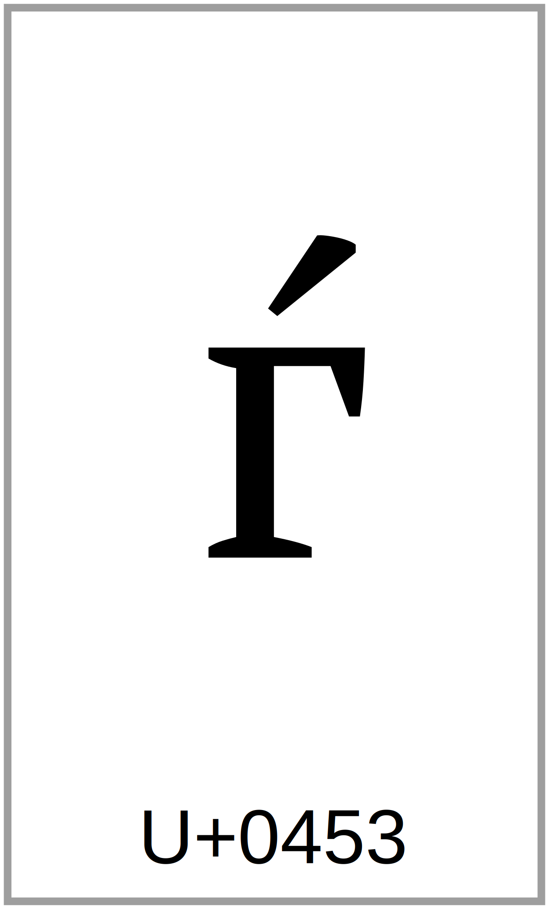 [txt](svg/lc/0453.txt) | ru |
| 38 | є | 0454 | Cyrillic Small Letter Ukrainian Ie |  |  | 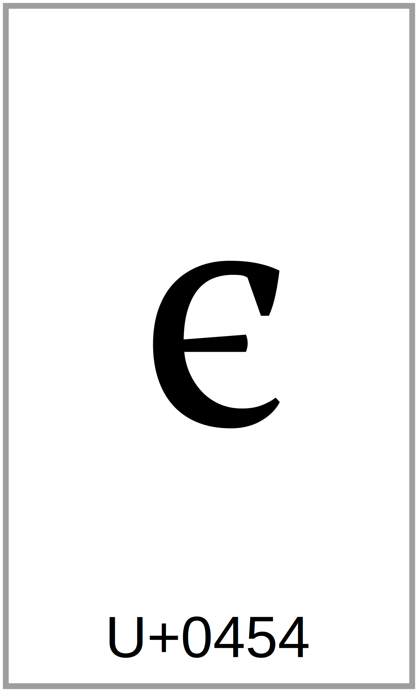 [txt](svg/lc/0454.txt) | ru |
| 39 | ѕ | 0455 | Cyrillic Small Letter Dze |  |  | 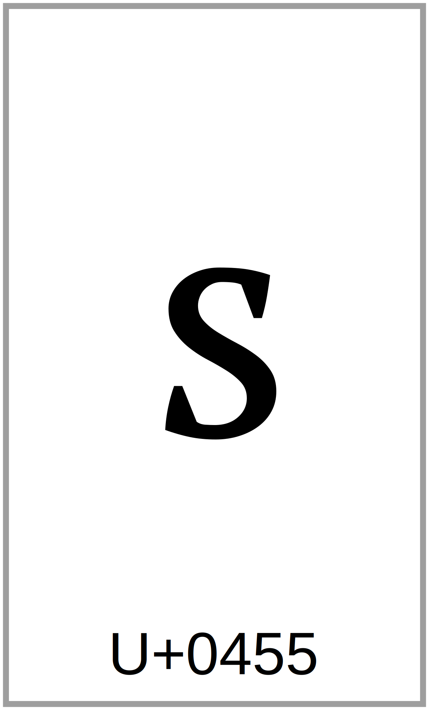 [txt](svg/lc/0455.txt) | ru |
| 40 | і | 0456 | Cyrillic Small Letter Byelorussian-Ukrainian I |  |  |  [txt](svg/lc/0456.txt) | ru |
| 41 | ї | 0457 | Cyrillic Small Letter Yi |  |  | 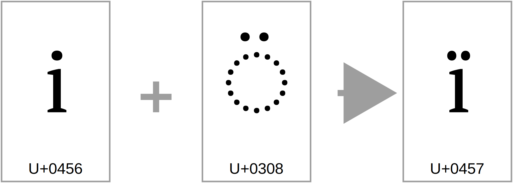 [txt](svg/lc/0457.txt) | ru |
| 42 | ј | 0458 | Cyrillic Small Letter Je |  |  |  [txt](svg/lc/0458.txt) | ru |
| 43 | љ | 0459 | Cyrillic Small Letter Lje |  |  | 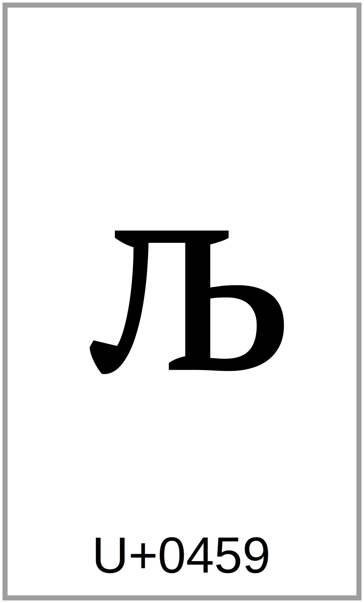 [txt](svg/lc/0459.txt) | ru |
| 44 | њ | 045A | Cyrillic Small Letter Nje |  |  |  [txt](svg/lc/045A.txt) | ru |
| 45 | ћ | 045B | Cyrillic Small Letter Tshe |  |  |  [txt](svg/lc/045B.txt) | ru |
| 46 | ќ | 045C | Cyrillic Small Letter Kje |  |  | 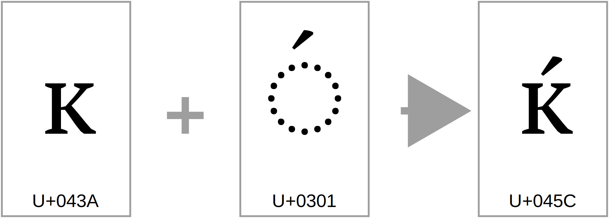 [txt](svg/lc/045C.txt) | ru |
| 47 | ѝ | 045D | Cyrillic Small Letter I With Grave |  | 0438 + 0300 | 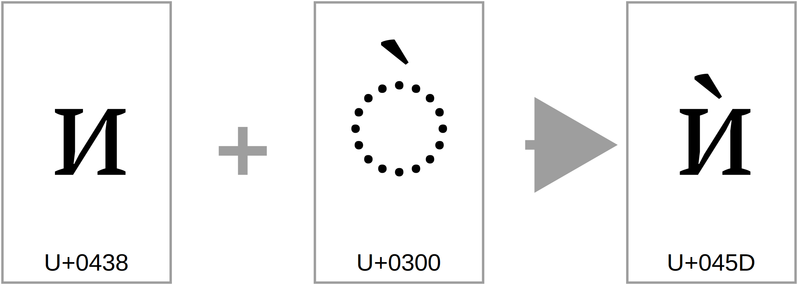 [txt](svg/lc/045D.txt) | ru |
| 48 | ў | 045E | Cyrillic Small Letter Short U |  |  |  [txt](svg/lc/045E.txt) | ru |
| 49 | џ | 045F | Cyrillic Small Letter Dzhe |  |  | 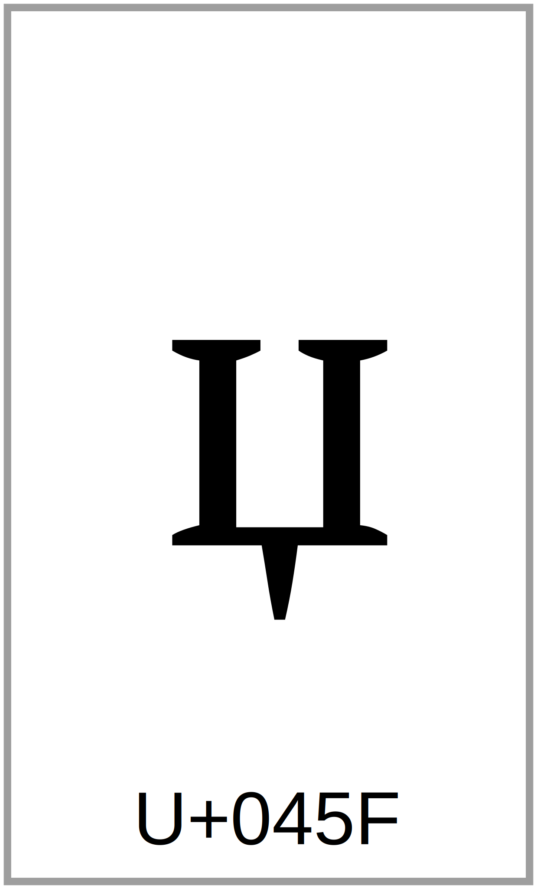 [txt](svg/lc/045F.txt) | ru |
| 50 | ѣ | 0463 | Cyrillic Small Letter Yat |  |  |  [txt](svg/lc/0463.txt) | bg, ru |
| 51 | ѥ | 0465 | Cyrillic Small Letter Iotified E |  |  | 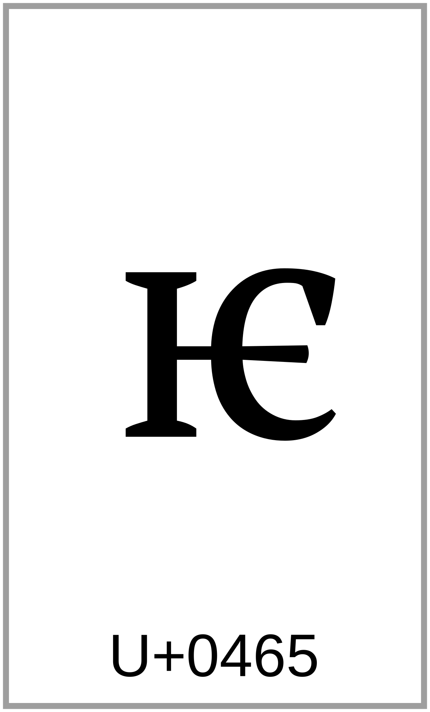 [txt](svg/lc/0465.txt) | bg, ru |
| 52 | ѫ | 046B | Cyrillic Small Letter Big Yus |  |  |  [txt](svg/lc/046B.txt) | ru |
| 53 | ѭ | 046D | Cyrillic Small Letter Iotified Big Yus |  |  |  [txt](svg/lc/046D.txt) | bg, ru |
| 54 | ѳ | 0473 | Cyrillic Small Letter Fita |  |  |  [txt](svg/lc/0473.txt) | ru |
| 55 | ѵ | 0475 | Cyrillic Small Letter Izhitsa |  |  | 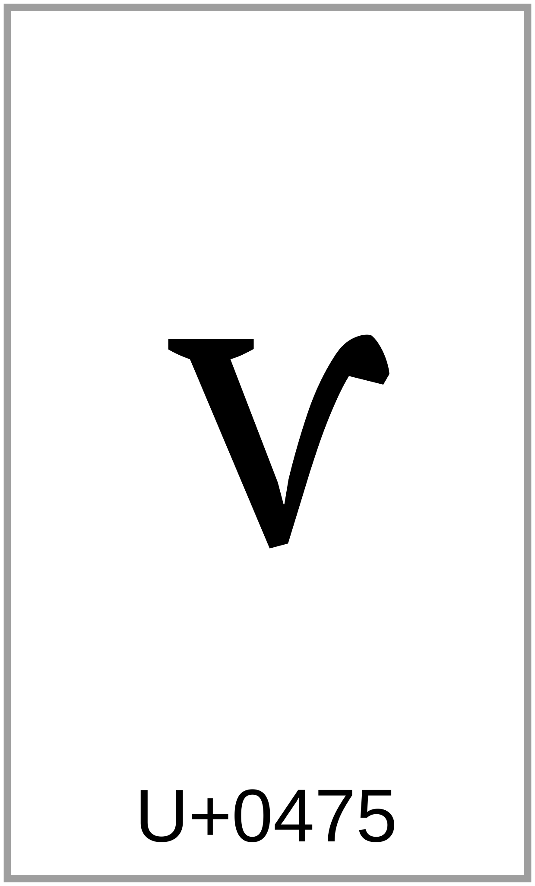 [txt](svg/lc/0475.txt) | ru |
| 56 | ҋ | 048B | Cyrillic Small Letter Short I With Tail |  |  | 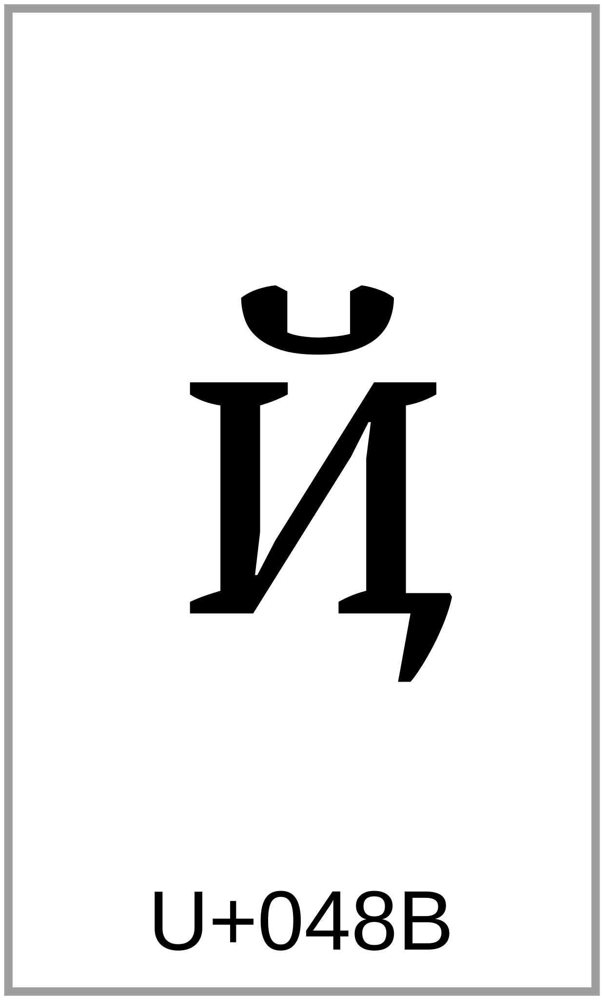 [txt](svg/lc/048B.txt) | ru |
| 57 | ҍ | 048D | Cyrillic Small Letter Semisoft Sign |  |  |  [txt](svg/lc/048D.txt) | ru |
| 58 | ҏ | 048F | Cyrillic Small Letter Er With Tick |  |  | 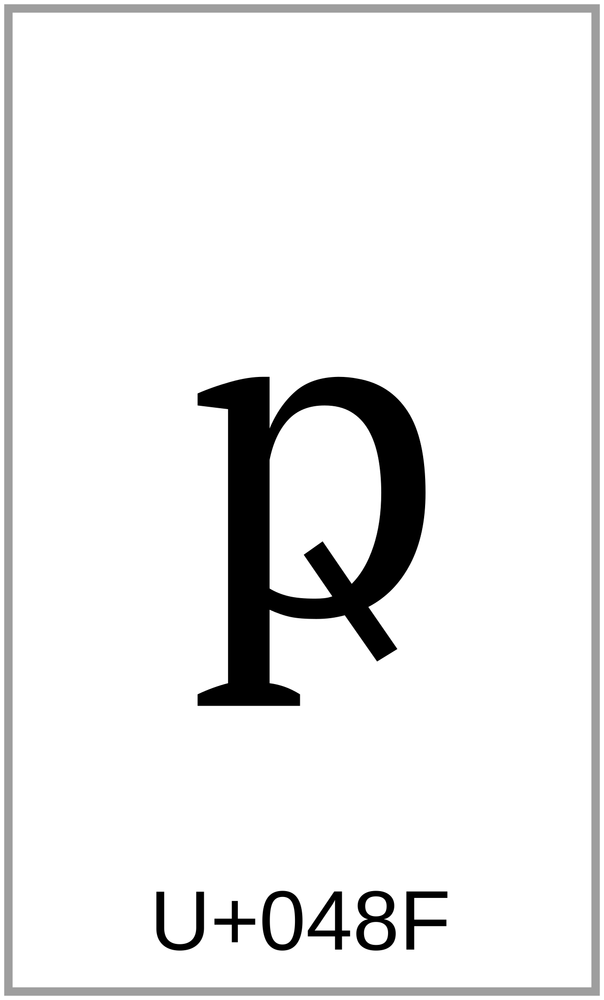 [txt](svg/lc/048F.txt) | ru |
| 59 | ґ | 0491 | Cyrillic Small Letter Ghe With Upturn |  |  |  [txt](svg/lc/0491.txt) | ru |
| 60 | ғ | 0493 | Cyrillic Small Letter Ghe With Stroke |  |  | 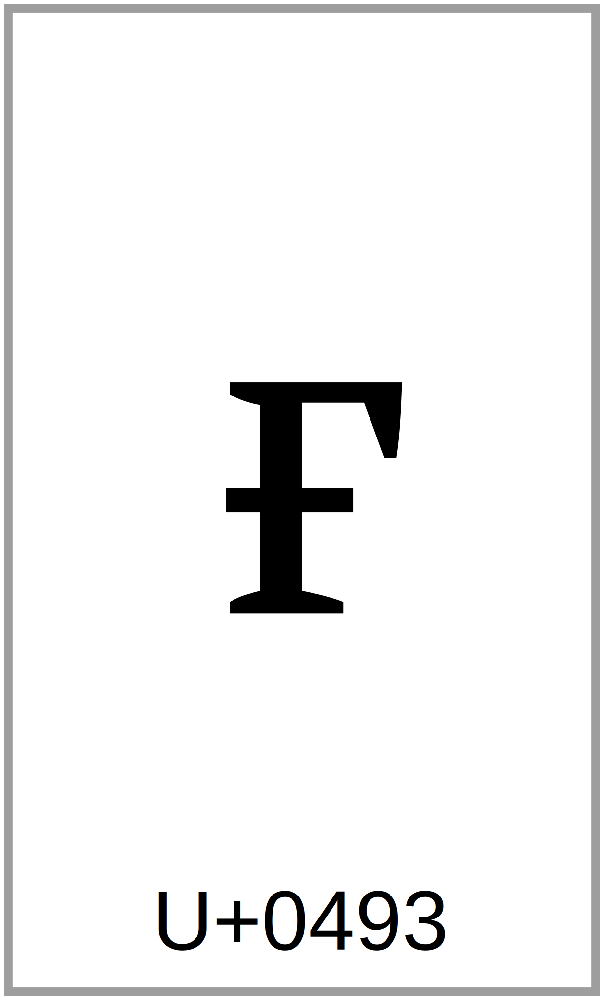 [txt](svg/lc/0493.txt) | ru |
| 61 | ҕ | 0495 | Cyrillic Small Letter Ghe With Middle Hook |  |  | 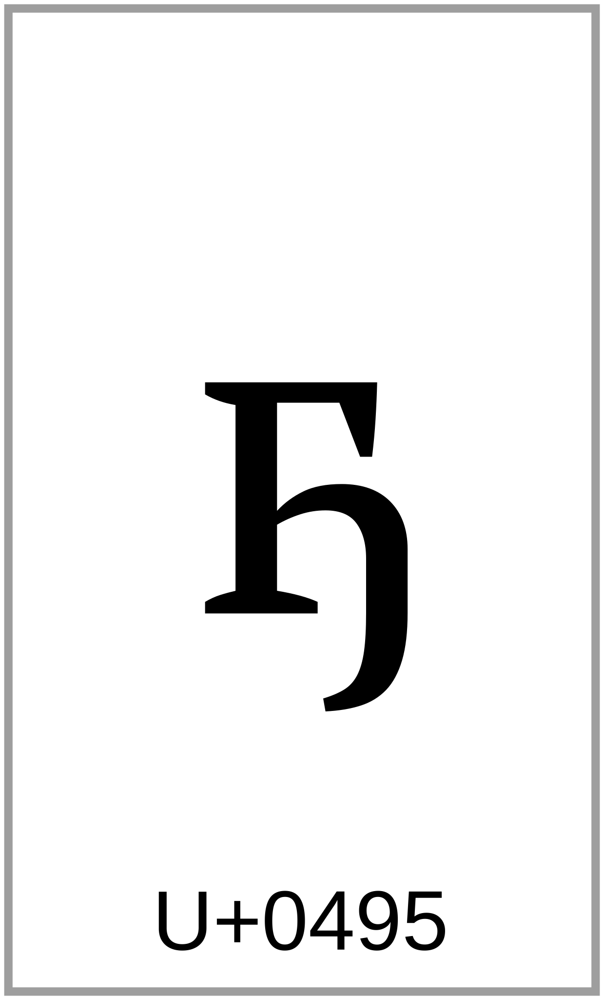 [txt](svg/lc/0495.txt) | ru |
| 62 | җ | 0497 | Cyrillic Small Letter Zhe With Descender |  |  |  [txt](svg/lc/0497.txt) | ru |
| 63 | ҙ | 0499 | Cyrillic Small Letter Ze With Descender |  |  | 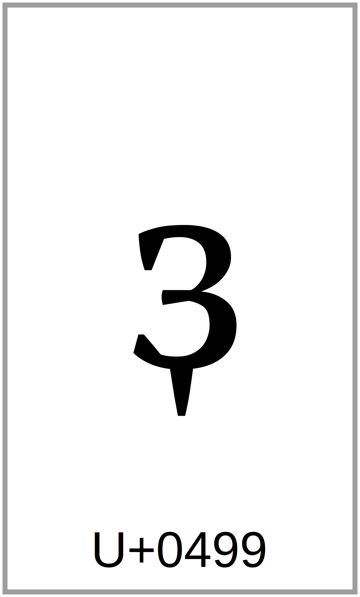 [txt](svg/lc/0499.txt) | ru |
| 64 | қ | 049B | Cyrillic Small Letter Ka With Descender |  |  |  [txt](svg/lc/049B.txt) | ru |
| 65 | ҝ | 049D | Cyrillic Small Letter Ka With Vertical Stroke |  |  | 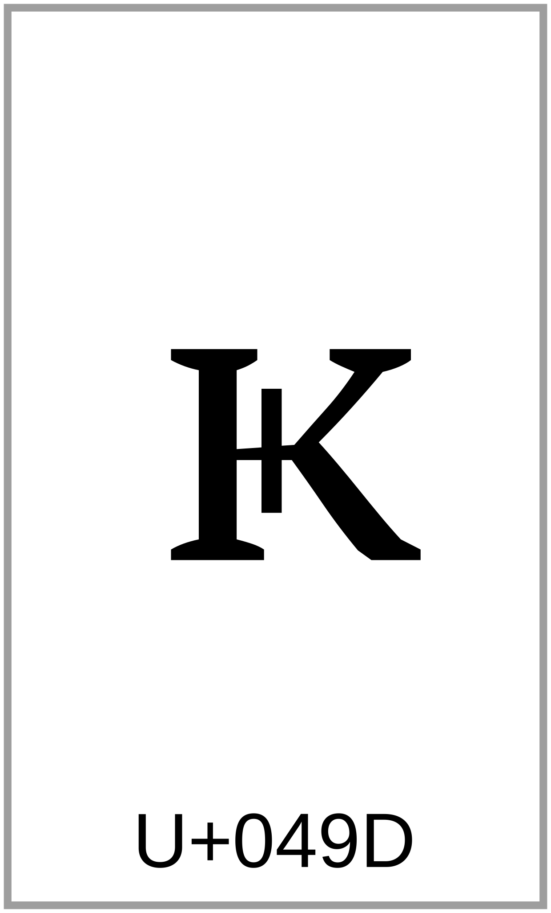 [txt](svg/lc/049D.txt) | ru |
| 66 | ҟ | 049F | Cyrillic Small Letter Ka With Stroke |  |  |  [txt](svg/lc/049F.txt) | ru |
| 67 | ҡ | 04A1 | Cyrillic Small Letter Bashkir Ka |  |  | 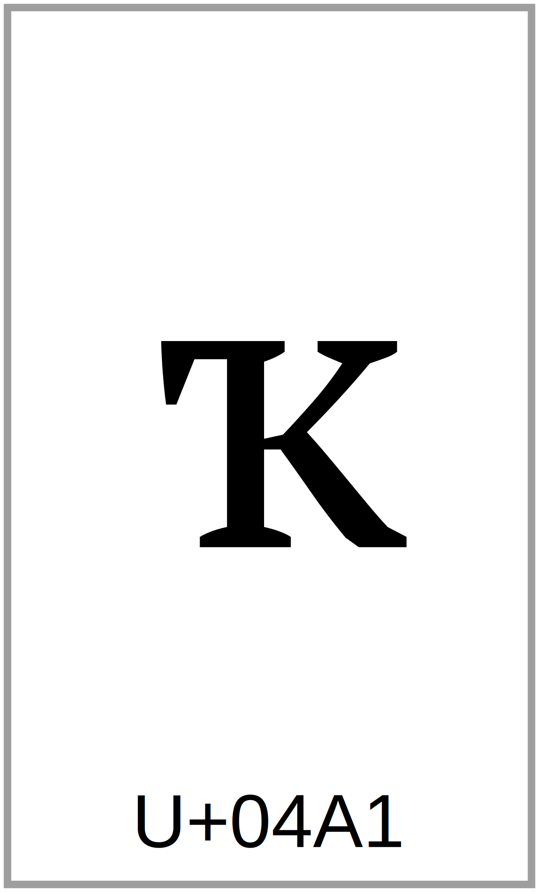 [txt](svg/lc/04A1.txt) | ru |
| 68 | ң | 04A3 | Cyrillic Small Letter En With Descender |  |  |  [txt](svg/lc/04A3.txt) | ru |
| 69 | ҥ | 04A5 | Cyrillic Small Ligature En Ghe |  |  | 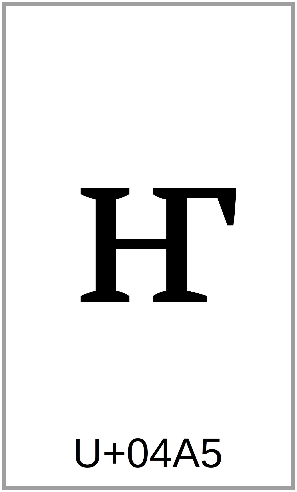 [txt](svg/lc/04A5.txt) | ru |
| 70 | ҧ | 04A7 | Cyrillic Small Letter Pe With Middle Hook |  |  |  [txt](svg/lc/04A7.txt) | ru |
| 71 | ҩ | 04A9 | Cyrillic Small Letter Abkhasian Ha |  |  |  [txt](svg/lc/04A9.txt) | ru |
| 72 | ҫ | 04AB | Cyrillic Small Letter Es With Descender |  |  | 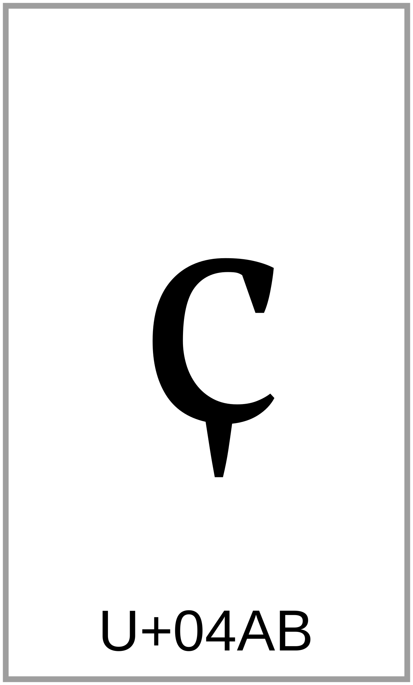 [txt](svg/lc/04AB.txt) | ru |
| 73 | ҭ | 04AD | Cyrillic Small Letter Te With Descender |  |  |  [txt](svg/lc/04AD.txt) | ru |
| 74 | ү | 04AF | Cyrillic Small Letter Straight U |  |  |  [txt](svg/lc/04AF.txt) | ru |
| 75 | ұ | 04B1 | Cyrillic Small Letter Straight U With Stroke |  |  |  [txt](svg/lc/04B1.txt) | ru |
| 76 | ҳ | 04B3 | Cyrillic Small Letter Ha With Descender |  |  | 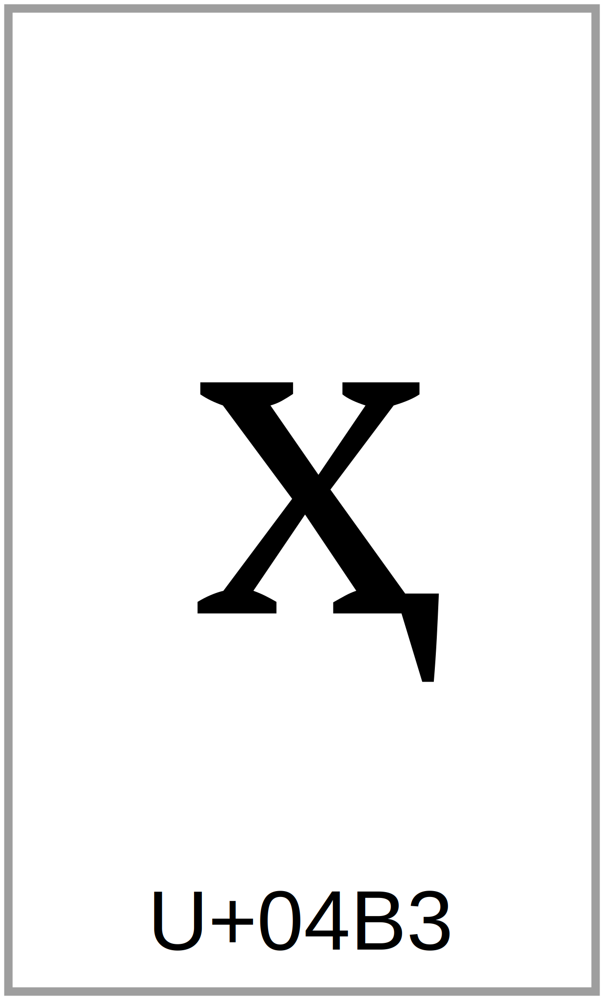 [txt](svg/lc/04B3.txt) | ru |
| 77 | ҵ | 04B5 | Cyrillic Small Ligature Te Tse |  |  |  [txt](svg/lc/04B5.txt) | ru |
| 78 | ҷ | 04B7 | Cyrillic Small Letter Che With Descender |  |  |  [txt](svg/lc/04B7.txt) | ru |
| 79 | ҹ | 04B9 | Cyrillic Small Letter Che With Vertical Stroke |  |  | 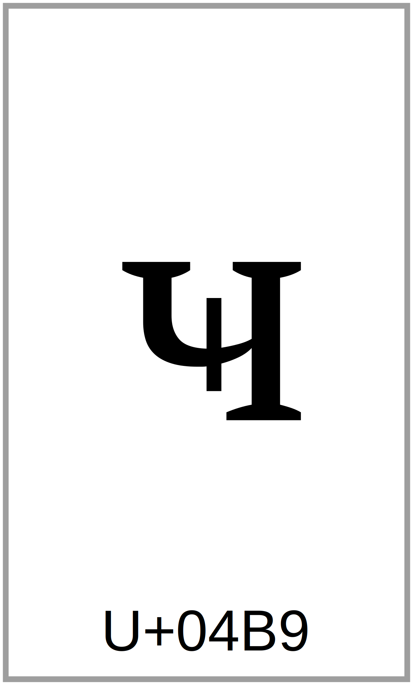 [txt](svg/lc/04B9.txt) | ru |
| 80 | һ | 04BB | Cyrillic Small Letter Shha |  |  | 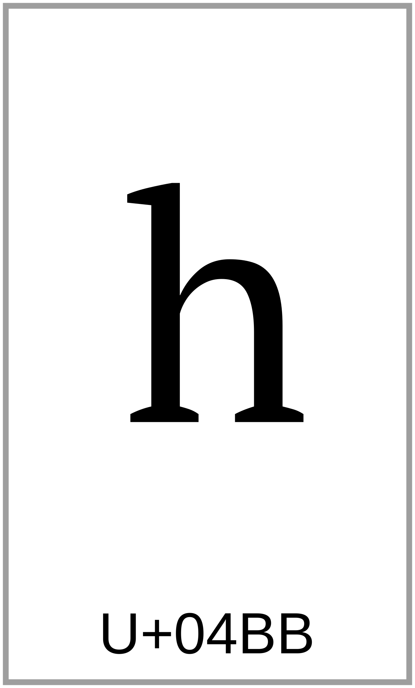 [txt](svg/lc/04BB.txt) | ru |
| 81 | ҽ | 04BD | Cyrillic Small Letter Abkhasian Che |  |  |  [txt](svg/lc/04BD.txt) | ru |
| 82 | ҿ | 04BF | Cyrillic Small Letter Abkhasian Che With Descender |  |  |  [txt](svg/lc/04BF.txt) | ru |
| 83 | ӂ | 04C2 | Cyrillic Small Letter Zhe With Breve |  | 0436 + F6D4 |  [txt](svg/lc/04C2.txt) | ru |
| 84 | ӄ | 04C4 | Cyrillic Small Letter Ka With Hook |  |  | 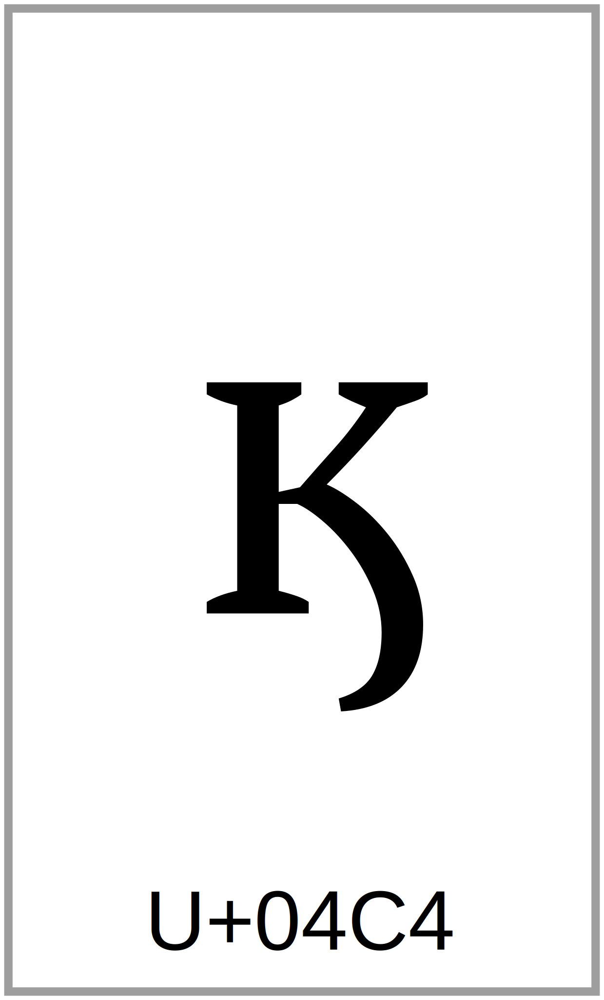 [txt](svg/lc/04C4.txt) | ru |
| 85 | ӆ | 04C6 | Cyrillic Small Letter El With Tail |  |  | 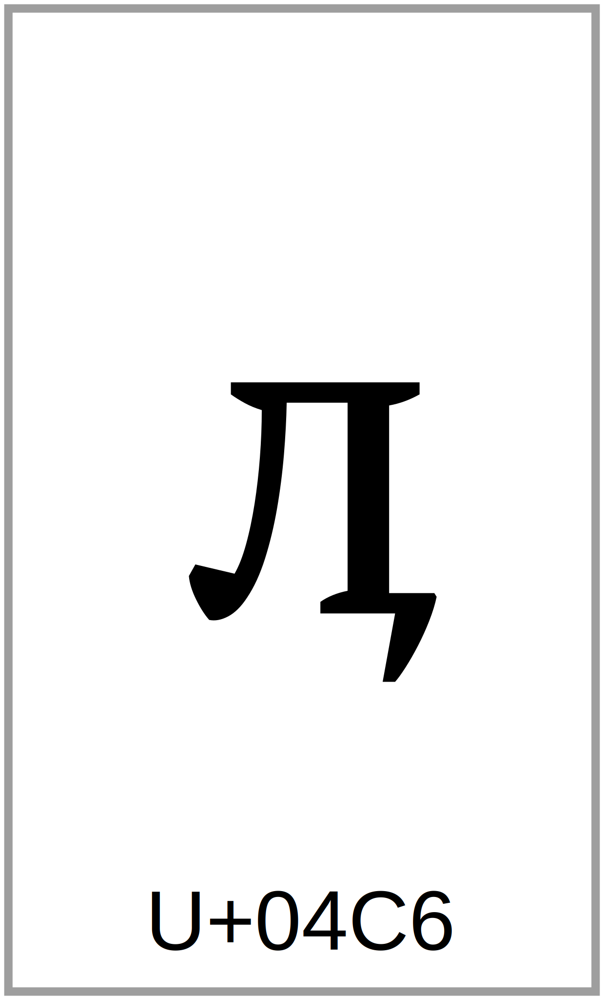 [txt](svg/lc/04C6.txt) | ru |
| 86 | ӈ | 04C8 | Cyrillic Small Letter En With Hook |  |  | 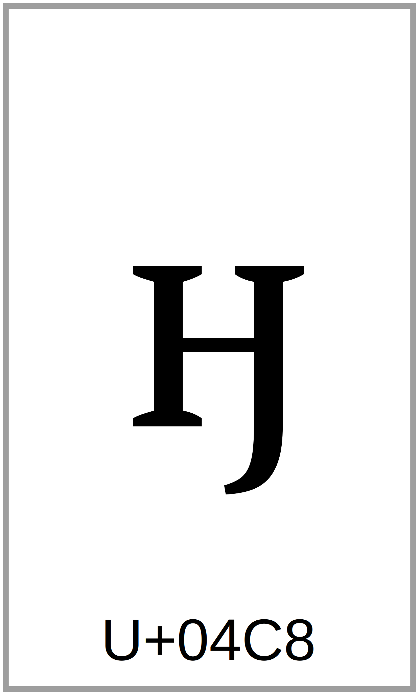 [txt](svg/lc/04C8.txt) | ru |
| 87 | ӊ | 04CA | Cyrillic Small Letter En With Tail |  |  |  [txt](svg/lc/04CA.txt) | ru |
| 88 | ӌ | 04CC | Cyrillic Small Letter Khakassian Che |  |  |  [txt](svg/lc/04CC.txt) | ru |
| 89 | ӎ | 04CE | Cyrillic Small Letter Em With Tail |  |  |  [txt](svg/lc/04CE.txt) | ru |
| 90 | ӏ | 04CF | Cyrillic Small Letter Palochka |  |  |  [txt](svg/lc/04CF.txt) | ru |
| 91 | ӑ | 04D1 | Cyrillic Small Letter A With Breve |  | 0430 + F6D4 |  [txt](svg/lc/04D1.txt) | ru |
| 92 | ӓ | 04D3 | Cyrillic Small Letter A With Diaeresis |  | 0430 + 0308 | 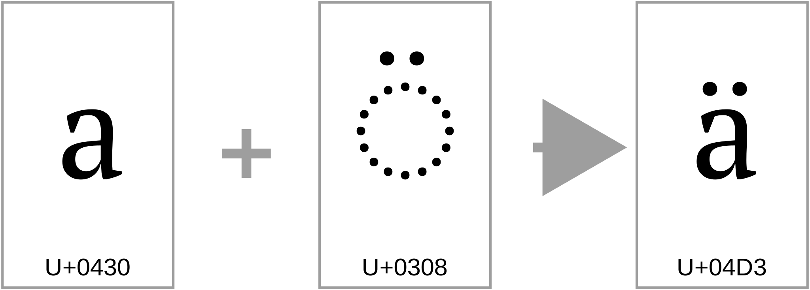 [txt](svg/lc/04D3.txt) | ru |
| 93 | ӕ | 04D5 | Cyrillic Small Ligature A Ie |  |  | 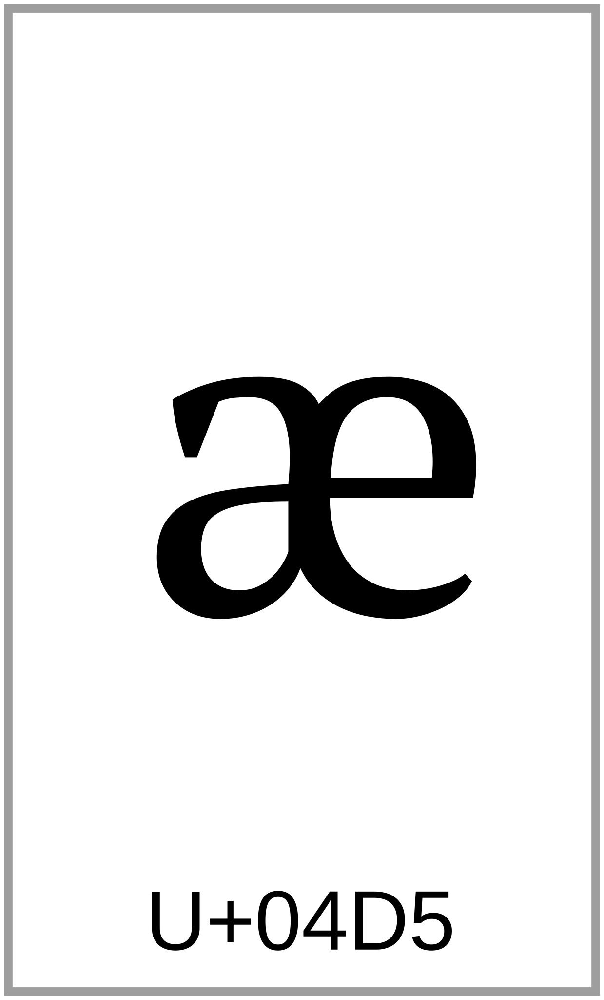 [txt](svg/lc/04D5.txt) | ru |
| 94 | ӗ | 04D7 | Cyrillic Small Letter Ie With Breve |  | 0435 + F6D4 | 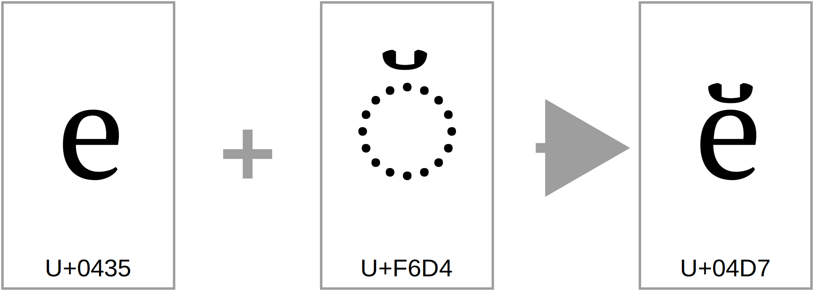 [txt](svg/lc/04D7.txt) | ru |
| 95 | ә | 04D9 | Cyrillic Small Letter Schwa |  |  | 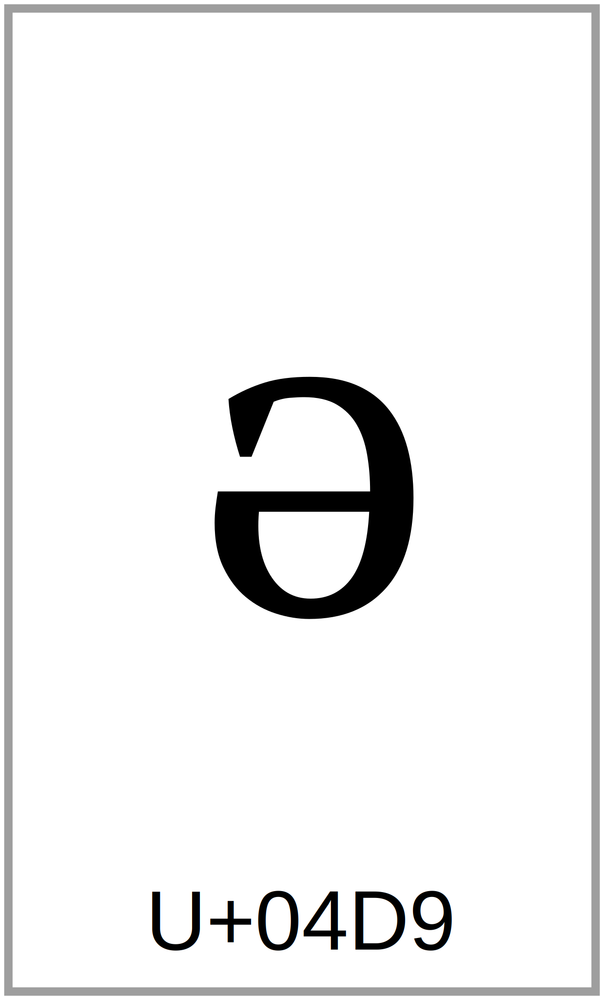 [txt](svg/lc/04D9.txt) | ru |
| 96 | ӛ | 04DB | Cyrillic Small Letter Schwa With Diaeresis |  | 04D9 + 0308 | 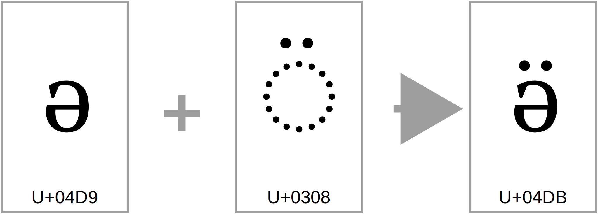 [txt](svg/lc/04DB.txt) | ru |
| 97 | ӝ | 04DD | Cyrillic Small Letter Zhe With Diaeresis |  | 0436 + 0308 | 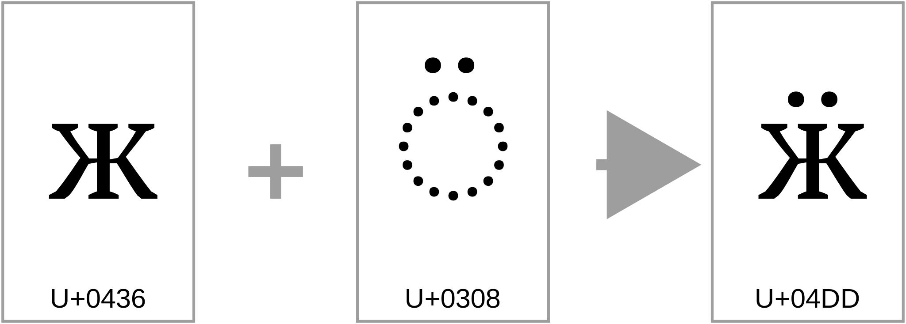 [txt](svg/lc/04DD.txt) | ru |
| 98 | ӟ | 04DF | Cyrillic Small Letter Ze With Diaeresis |  | 0437 + 0308 | 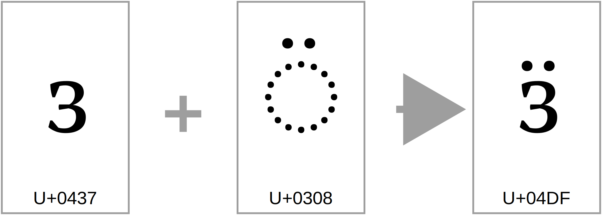 [txt](svg/lc/04DF.txt) | ru |
| 99 | ӡ | 04E1 | Cyrillic Small Letter Abkhasian Dze |  |  | 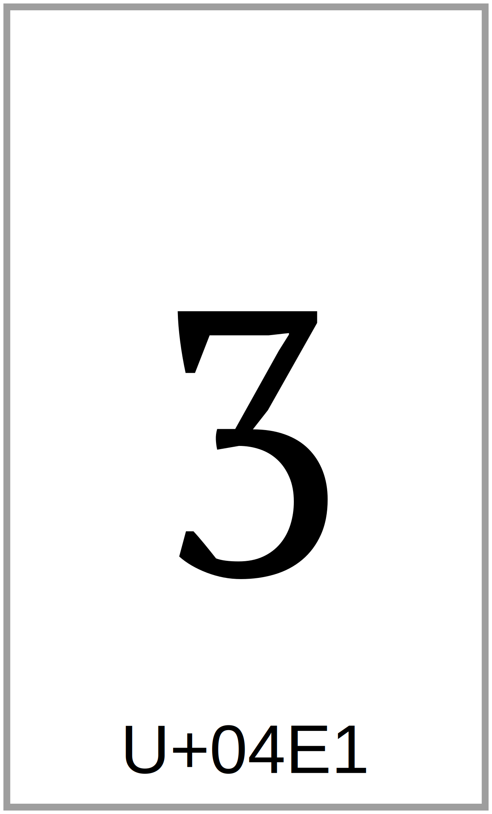 [txt](svg/lc/04E1.txt) | ru |
| 100 | ӣ | 04E3 | Cyrillic Small Letter I With Macron |  | 0438 + 0304 |  [txt](svg/lc/04E3.txt) | ru |
| 101 | ӥ | 04E5 | Cyrillic Small Letter I With Diaeresis |  | 0438 + 0308 |  [txt](svg/lc/04E5.txt) | ru |
| 102 | ӧ | 04E7 | Cyrillic Small Letter O With Diaeresis |  | 043E + 0308 |  [txt](svg/lc/04E7.txt) | ru |
| 103 | ө | 04E9 | Cyrillic Small Letter Barred O |  |  |  [txt](svg/lc/04E9.txt) | ru |
| 104 | ӫ | 04EB | Cyrillic Small Letter Barred O With Diaeresis |  | 04E9 + 0308 |  [txt](svg/lc/04EB.txt) | ru |
| 105 | ӭ | 04ED | Cyrillic Small Letter E With Diaeresis |  | 044D + 0308 |  [txt](svg/lc/04ED.txt) | ru |
| 106 | ӯ | 04EF | Cyrillic Small Letter U With Macron |  | 0443 + 0304 |  [txt](svg/lc/04EF.txt) | ru |
| 107 | ӱ | 04F1 | Cyrillic Small Letter U With Diaeresis |  | 0443 + 0308 |  [txt](svg/lc/04F1.txt) | ru |
| 108 | ӳ | 04F3 | Cyrillic Small Letter U With Double Acute |  | 0443 + 030B |  [txt](svg/lc/04F3.txt) | ru |
| 109 | ӵ | 04F5 | Cyrillic Small Letter Che With Diaeresis |  | 0447 + 0308 |  [txt](svg/lc/04F5.txt) | ru |
| 110 | ӷ | 04F7 | Cyrillic Small Letter Ghe With Descender |  |  | 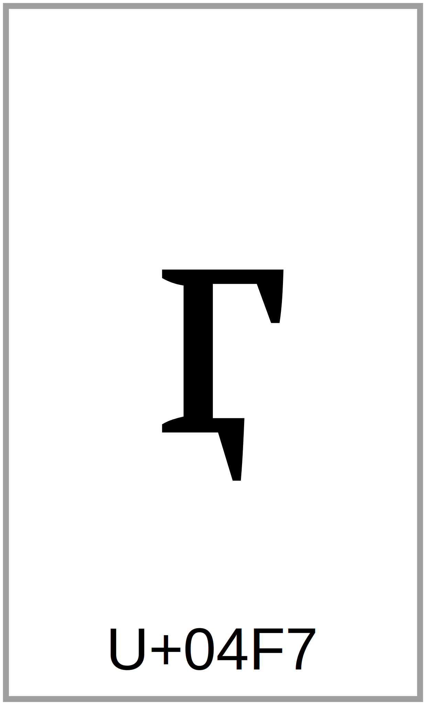 [txt](svg/lc/04F7.txt) | ru |
| 111 | ӹ | 04F9 | Cyrillic Small Letter Yeru With Diaeresis |  | 044B + 0308 |  [txt](svg/lc/04F9.txt) | ru |
| 112 | ӻ | 04FB | Cyrillic Small Letter Ghe With Stroke And Hook |  |  |  [txt](svg/lc/04FB.txt) | ru |
| 113 | ӽ | 04FD | Cyrillic Small Letter Ha With Hook |  |  |  [txt](svg/lc/04FD.txt) | ru |
| 114 | ӿ | 04FF | Cyrillic Small Letter Ha With Stroke |  |  | 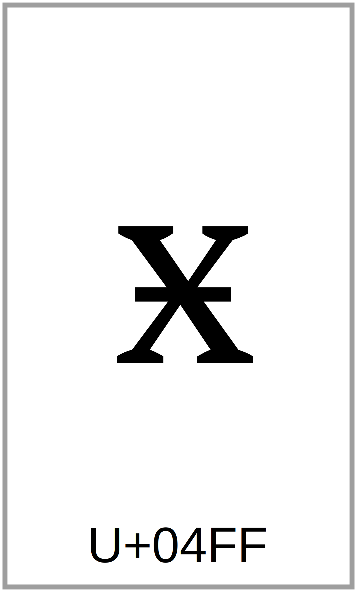 [txt](svg/lc/04FF.txt) | ru |
| 115 | ԑ | 0511 | Cyrillic Small Letter Reversed Ze |  |  | 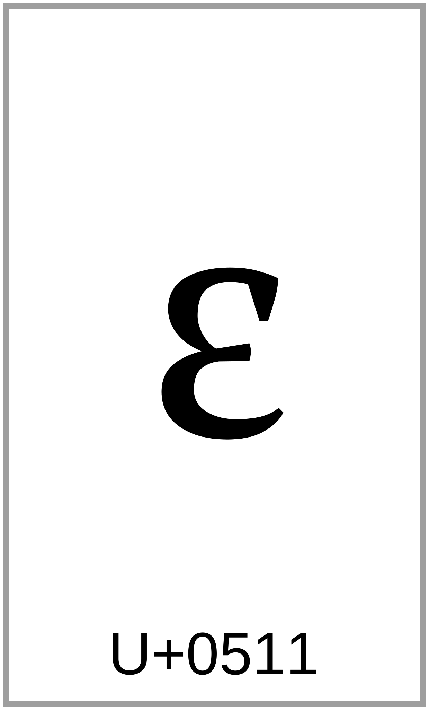 [txt](svg/lc/0511.txt) | ru |
| 116 | ԓ | 0513 | Cyrillic Small Letter El With Hook |  |  |  [txt](svg/lc/0513.txt) | ru |
| 117 | ԛ | 051B | Cyrillic Small Letter Qa |  |  |  [txt](svg/lc/051B.txt) | ru |
| 118 | ԝ | 051D | Cyrillic Small Letter We |  |  |  [txt](svg/lc/051D.txt) | ru |
| 119 | ԥ | 0525 | Cyrillic Small Letter Pe With Descender |  |  |  [txt](svg/lc/0525.txt) | ru |
| 120 | ԧ | 0527 | Cyrillic Small Letter Shha With Descender |  |  | 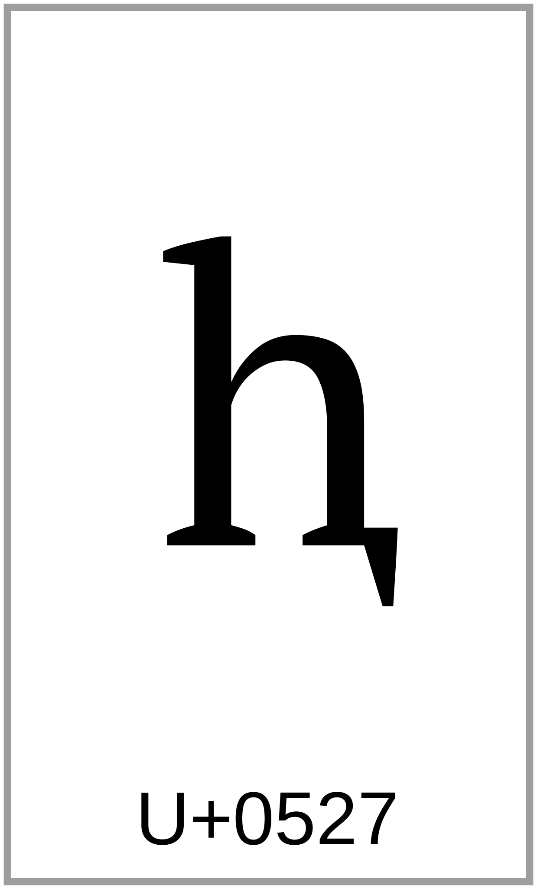 [txt](svg/lc/0527.txt) | ru |
| 121 | ԯ | 052F | Cyrillic Small Letter El With Descender |  |  |  [txt](svg/lc/052F.txt) | ru |
| 122 | ꙗ | A657 | Cyrillic Small Letter Iotified A |  |  | 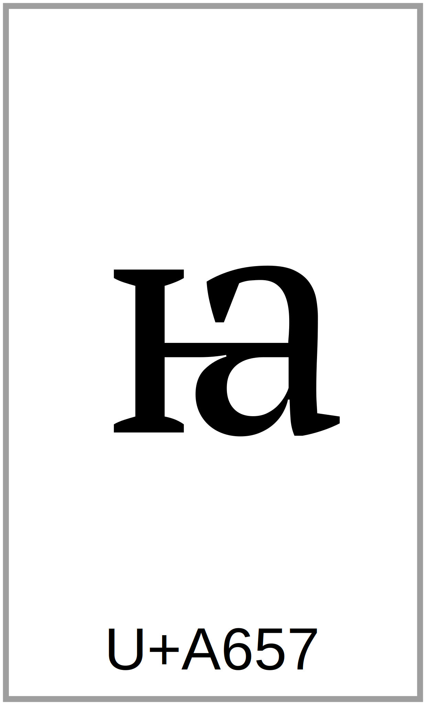 [txt](svg/lc/A657.txt) | bg, ru |
| 123 |  | F43B | Cyrillic Small Letter Straight U With Macron | yes | 04AF + 0304 |  [txt](svg/lc/F43B.txt) | ru |
| 124 |  | F46A | Cyrillic Small Letter A With Acute | yes | 0430 + 0301 |  [txt](svg/lc/F46A.txt) | ru |
| 125 |  | F46B | Cyrillic Small Letter Ie With Acute | yes | 0435 + 0301 | 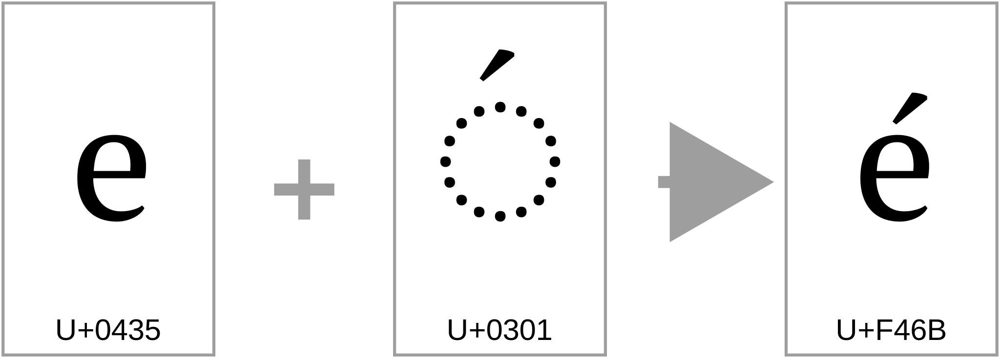 [txt](svg/lc/F46B.txt) | ru |
| 126 |  | F46C | Cyrillic Small Letter I With Acute | yes | 0438 + 0301 |  [txt](svg/lc/F46C.txt) | ru |
| 127 |  | F46D | Cyrillic Small Letter O With Acute | yes | 043E + 0301 |  [txt](svg/lc/F46D.txt) | ru |
| 128 |  | F46E | Cyrillic Small Letter U With Acute | yes | 0443 + 0301 | 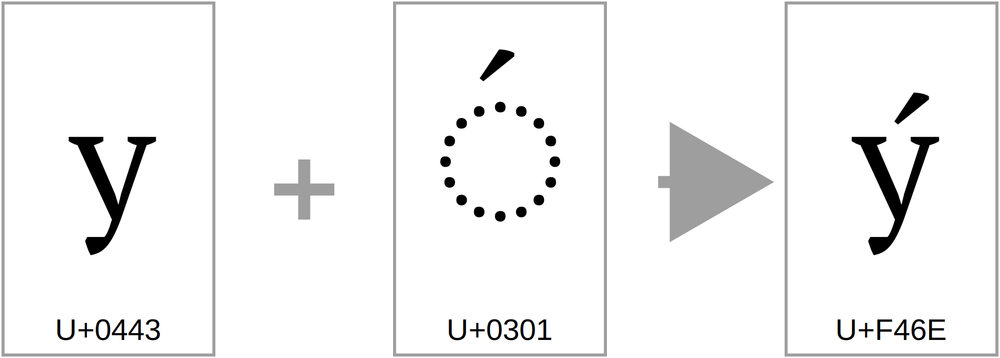 [txt](svg/lc/F46E.txt) | ru |
| 129 |  | F46F | Cyrillic Small Letter Yeru With Acute | yes | 044B + 0301 |  [txt](svg/lc/F46F.txt) | ru |
| 130 |  | F470 | Cyrillic Small Letter E With Acute | yes | 044D + 0301 |  [txt](svg/lc/F470.txt) | ru |
| 131 |  | F471 | Cyrillic Small Letter Yu With Acute | yes | 044E + 0301 |  [txt](svg/lc/F471.txt) | ru |
| 132 |  | F472 | Cyrillic Small Letter Ya With Acute | yes | 044F + 0301 | 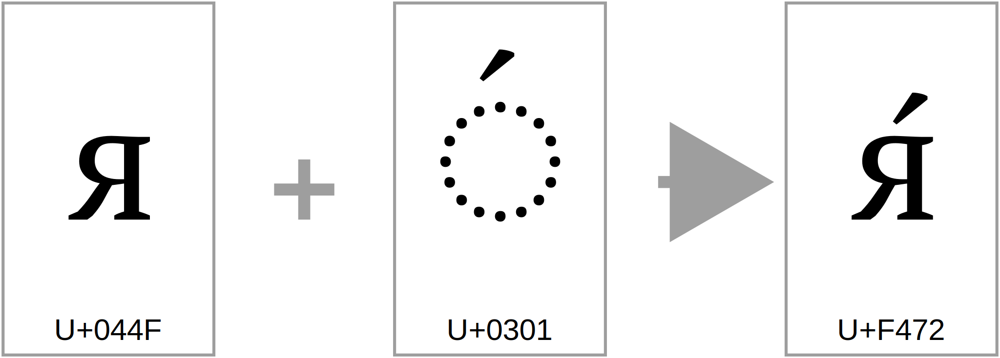 [txt](svg/lc/F472.txt) | ru |
| 133 |  | F473 | Cyrillic Small Letter Ie With Diaeresis And Acute | yes | 0435 + 0308 + 0301 | 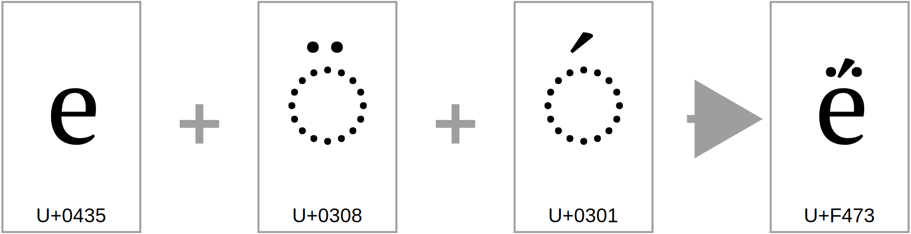 [txt](svg/lc/F473.txt) | ru |
| 134 |  | F499 | Cyrillic Small Letter Yu With Diaeresis | yes | 044E + 0308 |  [txt](svg/lc/F499.txt) | ru |
| 135 |  | F49B | Cyrillic Small Letter Barred O With Macron | yes | 04E9 + 0304 |  [txt](svg/lc/F49B.txt) | ru |
| 136 |  | F49D | Cyrillic Small Letter Schwa With Macron | yes | 04D9 + 0304 |  [txt](svg/lc/F49D.txt) | ru |
| 137 |  | F49F | Cyrillic Small Letter Shha With Bar | yes |  | 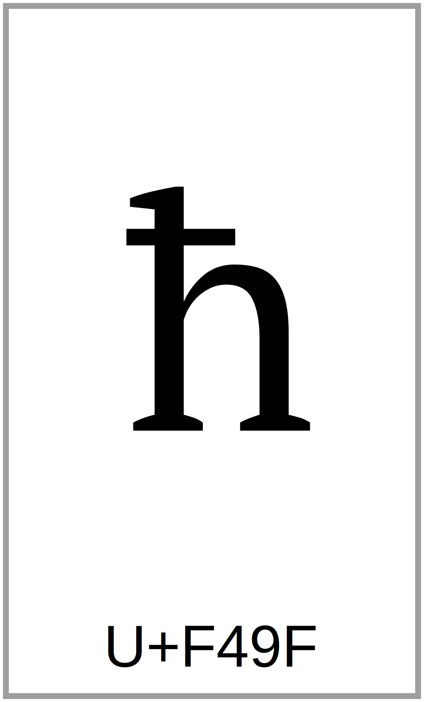 [txt](svg/lc/F49F.txt) | ru |
| 138 |  | F4C7 | Cyrillic Small Letter Che With Hook | yes |  |  [txt](svg/lc/F4C7.txt) | ru |
| 139 |  | F4CD | Cyrillic Small Letter U With Acute | yes | 0443 + 0301 |  [txt](svg/lc/F4CD.txt) | ru |
| 140 |  | F4D3 | Cyrillic Small Letter O With Grave | yes | 043E + 0300 |  [txt](svg/lc/F4D3.txt) | ru |
| 141 |  | F4D5 | Cyrillic Small Letter Er With Caron | yes | 0440 + 030C | 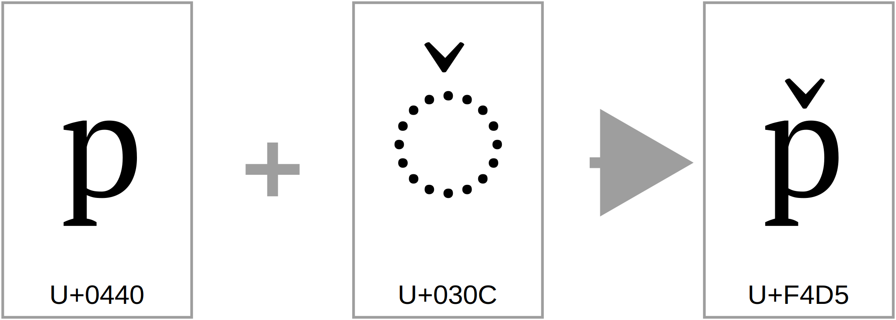 [txt](svg/lc/F4D5.txt) | ru |
| 142 |  | F4D7 | Cyrillic Small Letter E With Dot Above | yes | 044D + 0307 |  [txt](svg/lc/F4D7.txt) | ru |
| 143 |  | F4D9 | Cyrillic Small Letter Ya With Diaeresis | yes | 044F + 0308 |  [txt](svg/lc/F4D9.txt) | ru |
| 144 |  | F50B | Cyrillic Small Letter Ze With Tail | yes |  | 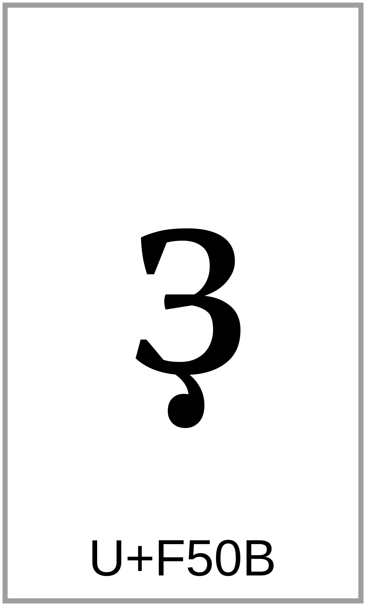 [txt](svg/lc/F50B.txt) | ba |
| 145 |  | F50D | Cyrillic Small Letter Es With Cedilla | yes | 0441 + 0327 | 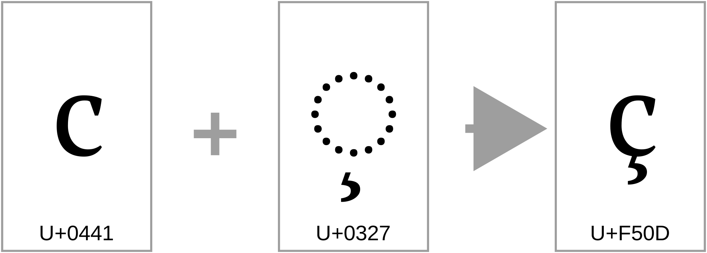 [txt](svg/lc/F50D.txt) | ru |
| 146 |  | F50F | Cyrillic Small Letter A With Macron | yes | 0430 + 0304 |  [txt](svg/lc/F50F.txt) | ru |
| 147 |  | F511 | Cyrillic Small Letter Ie With Macron | yes | 0435 + 0304 |  [txt](svg/lc/F511.txt) | ru |
| 148 |  | F513 | Cyrillic Small Letter Ie With Diaeresis And Macron | yes | 0435 + 0308 + 0304 |  [txt](svg/lc/F513.txt) | ru |
| 149 |  | F515 | Cyrillic Small Letter Ie With Diaeresis And Breve | yes | 0435 + 0308 + F6D4 | 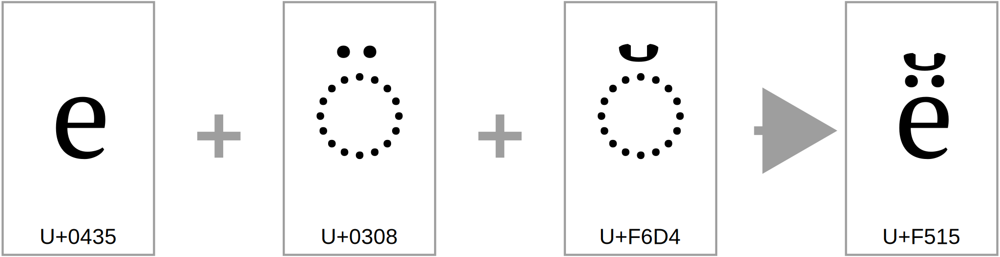 [txt](svg/lc/F515.txt) | ru |
| 150 |  | F517 | Cyrillic Small Letter Ze With Caron | yes | 0437 + 030C | 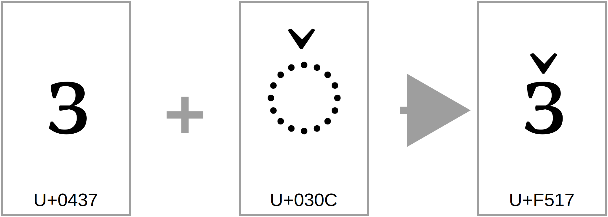 [txt](svg/lc/F517.txt) | ru |
| 151 |  | F519 | Cyrillic Small Letter O With Macron | yes | 043E + 0304 | 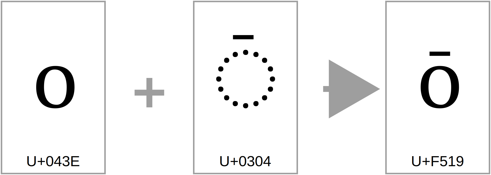 [txt](svg/lc/F519.txt) | ru |
| 152 |  | F51B | Cyrillic Small Letter O With Breve | yes | 043E + F6D4 |  [txt](svg/lc/F51B.txt) | ru |
| 153 |  | F51D | Cyrillic Small Letter Barred O With Breve | yes | 04E9 + F6D4 |  [txt](svg/lc/F51D.txt) | ru |
| 154 |  | F51F | Cyrillic Small Letter Barred O With Diaeresis And Breve | yes | 04E9 + 0308 + F6D4 | 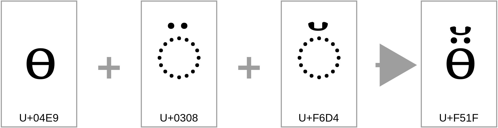 [txt](svg/lc/F51F.txt) | ru |
| 155 |  | F521 | Cyrillic Small Letter Yeru With Macron | yes | 044B + 0304 | 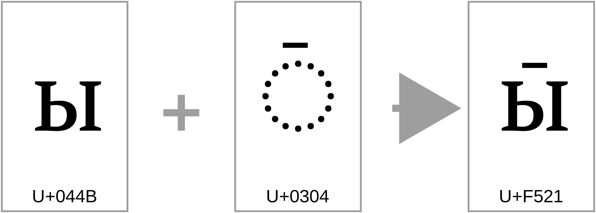 [txt](svg/lc/F521.txt) | ru |
| 156 |  | F523 | Cyrillic Small Letter E With Macron | yes | 044D + 0304 |  [txt](svg/lc/F523.txt) | ru |
| 157 |  | F525 | Cyrillic Small Letter E With Breve | yes | 044D + F6D4 |  [txt](svg/lc/F525.txt) | ru |
| 158 |  | F527 | Cyrillic Small Letter Ukrainian Ie With Diaeresis | yes | 0454 + 0308 | 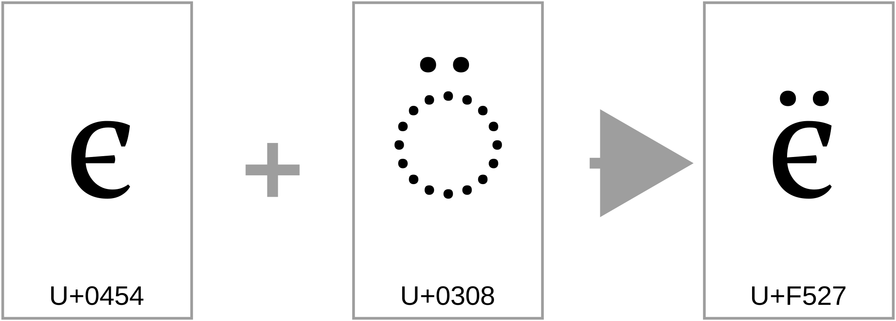 [txt](svg/lc/F527.txt) | ru |
| 159 |  | F529 | Cyrillic Small Letter Ya With Macron | yes | 044F + 0304 |  [txt](svg/lc/F529.txt) | ru |
| 160 |  | F52B | Cyrillic Small Letter Ya With Breve | yes | 044F + F6D4 |  [txt](svg/lc/F52B.txt) | ru |
| 161 |  | F52D | Cyrillic Small Letter Yu With Macron | yes | 044E + 0304 |  [txt](svg/lc/F52D.txt) | ru |
| 162 |  | F52F | Cyrillic Small Letter Yu With Breve | yes | 044E + F6D4 |  [txt](svg/lc/F52F.txt) | ru |
| 163 |  | F533 | Cyrillic Small Letter Short I With Hook | yes |  |  [txt](svg/lc/F533.txt) | ru |
| 164 |  | F537 | Cyrillic Small Letter Yeru With Breve | yes | 044B + F6D4 |  [txt](svg/lc/F537.txt) | ru |
| 165 |  | F539 | Cyrillic Small Letter Reversed Ze With Diaeresis | yes | 0511 + 0308 |  [txt](svg/lc/F539.txt) | ru |
| 166 |  | F53D | Cyrillic Small Letter Ghe With Stroke | yes |  | 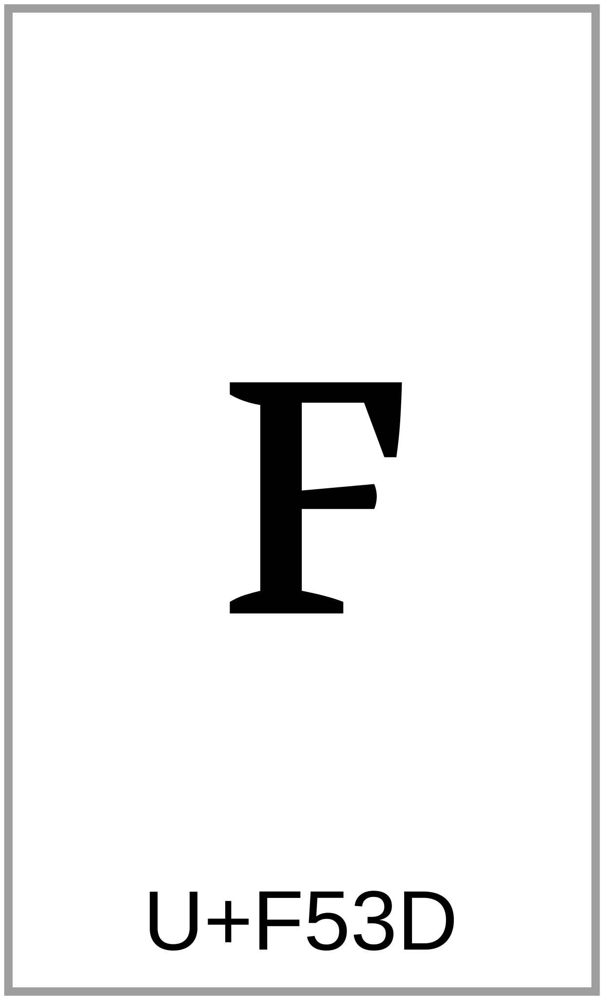 [txt](svg/lc/F53D.txt) | ba |
| 167 |  | F53F | Cyrillic Small Letter Es With Tail | yes |  | 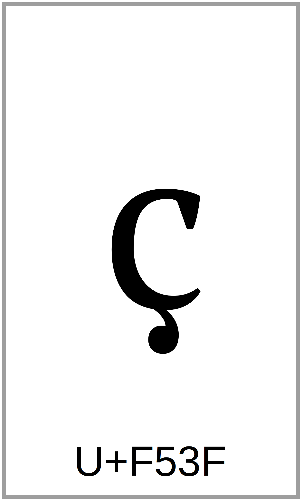 [txt](svg/lc/F53F.txt) | ba |
| 168 |  | F831 | Cyrillic Small Letter A With Circumflex | yes | 0430 + 0302 |  [txt](svg/lc/F831.txt) | ru |
| 169 |  | F834 | Cyrillic Small Letter Ie With Circumflex | yes | 0435 + 0302 |  [txt](svg/lc/F834.txt) | ru |
| 170 |  | F83A | Cyrillic Small Letter O With Circumflex | yes | 043E + 0302 |  [txt](svg/lc/F83A.txt) | ru |
| 171 |  | F870 | Cyrillic Small Letter Ka With Macron | yes | 043A + 0304 | 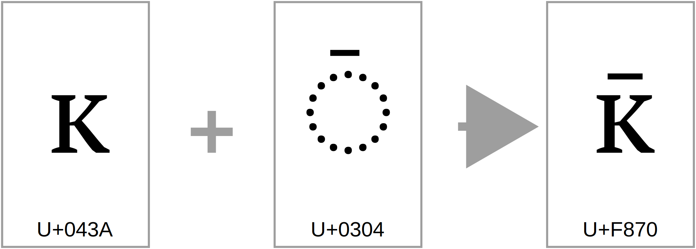 [txt](svg/lc/F870.txt) | ru |
| 172 |  | F873 | Cyrillic Small Letter El With Macron | yes | 043B + 0304 |  [txt](svg/lc/F873.txt) | ru |
| 173 |  | F876 | Cyrillic Small Letter Es With Macron | yes | 0441 + 0304 |  [txt](svg/lc/F876.txt) | ru |
| 174 |  | F879 | Cyrillic Small Letter Ha With Macron | yes | 0445 + 0304 |  [txt](svg/lc/F879.txt) | ru |
| 175 |  | F87C | Cyrillic Small Letter Tse With Macron | yes | 0446 + 0304 |  [txt](svg/lc/F87C.txt) | ru |
| 176 |  | F87F | Cyrillic Small Letter Che With Macron | yes | 0447 + 0304 |  [txt](svg/lc/F87F.txt) | ru |
