# Glyph variants

Glyphs that do **not** have their own Unicode codepoint: they share a codepoint with a base letter, but render as a different shape under an OpenType feature — typically `locl` (localized form, selected by the active language) or a stylistic alternate tied to upright (`.str`) or italic (`.ita`) shaping.

This table complements the pan-Cyrillic character tables in `characters-uppercase.md` / `characters-lowercase.md`, which are deduplicated by codepoint. The entries below are the variant-form rows that the codepoint-level view collapses.

**82** variant forms — 41 localized (`&`), 41 alternate (`+`). Style breakdown: any=48, straight=17, italic=17. Locales represented: ba, bg, cv, sr.

## Columns

- **Codepoint** — the Unicode codepoint this variant maps to. Same as the base letter in the main table.
- **Case** — uppercase / lowercase.
- **Locale** — the source language's `local` field. Only non-default locales (`bg` Bulgarian, `sr` Serbian, `ba` Bashkir, `cv` Chuvash) appear here, because ru-default languages do not produce locl shape variants — their `+` alternates are stylistic forms of letters that already have their own Unicode codepoint, listed in the main character table instead.
- **Style** — `straight` or `italic` when the source token has a `.str` / `.ita` suffix; `any` otherwise.
- **Marker** — `localized` (source token started with `&`) or `alternate` (source token started with `+`).
- **Token(s)** — verbatim source token(s) from `library/cyrillic/base/*.json`.
- **Languages** — language files that declare this variant.

## Variants

| # | Codepoint | Case | Locale | Style | Marker | Token(s) | Diagram | Languages |
| ---: | --- | --- | --- | --- | --- | --- | :---: | --- |
| 1 | 0414 | uppercase | bg | any | alternate | `+Д` |  | Bulgarian |
| 2 | 0414 | uppercase | bg | any | localized | `&Д` | 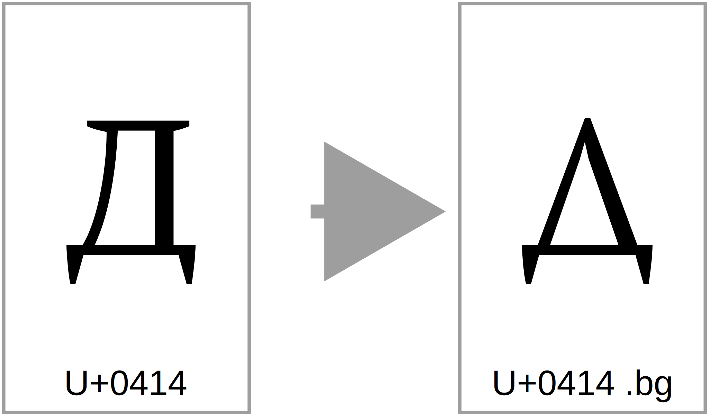 [txt](svg/variants/0414.bg.txt) | Bulgarian |
| 3 | 0416 | uppercase | bg | any | alternate | `+Ж` |  | Bulgarian |
| 4 | 0416 | uppercase | bg | any | localized | `&Ж` |  [txt](svg/variants/0416.bg.txt) | Bulgarian |
| 5 | 041A | uppercase | bg | any | alternate | `+К` |  | Bulgarian |
| 6 | 041A | uppercase | bg | any | localized | `&К` |  [txt](svg/variants/041A.bg.txt) | Bulgarian |
| 7 | 041B | uppercase | bg | any | alternate | `+Л` |  | Bulgarian |
| 8 | 041B | uppercase | bg | any | localized | `&Л` | 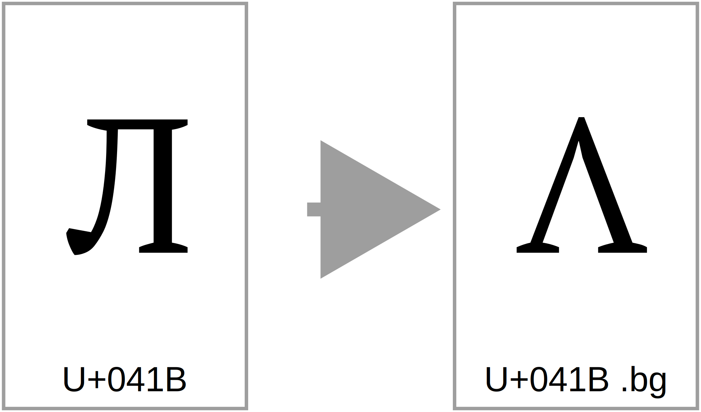 [txt](svg/variants/041B.bg.txt) | Bulgarian |
| 9 | 0431 | lowercase | sr | any | alternate | `+б` |  | Macedonian, Serbian |
| 10 | 0431 | lowercase | sr | any | localized | `&б` | 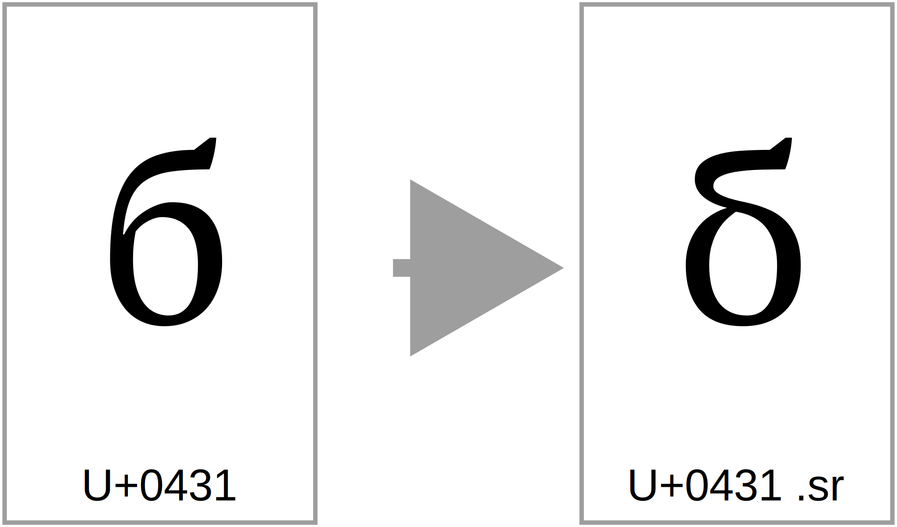 [txt](svg/variants/0431.sr.txt) | Macedonian, Serbian |
| 11 | 0432 | lowercase | bg | any | alternate | `+в` |  | Bulgarian |
| 12 | 0432 | lowercase | bg | any | localized | `&в` |  [txt](svg/variants/0432.bg.txt) | Bulgarian |
| 13 | 0433 | lowercase | bg | italic | alternate | `+г.ita` |  | Bulgarian |
| 14 | 0433 | lowercase | bg | straight | localized | `&г.str` | 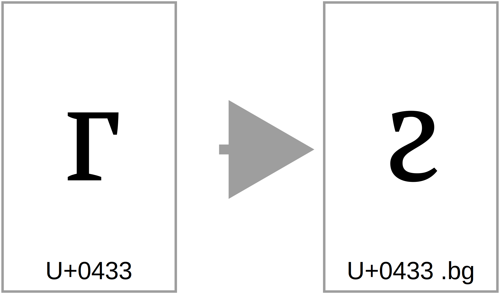 [txt](svg/variants/0433.bg.txt) | Bulgarian |
| 15 | 0433 | lowercase | sr | italic | localized | `&г.ita` | 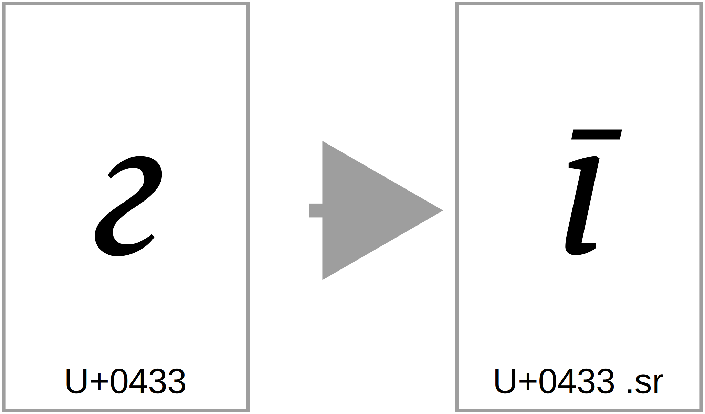 [txt](svg/variants/0433.sr.txt) | Serbian |
| 16 | 0433 | lowercase | sr | straight | alternate | `+г.str` |  | Serbian |
| 17 | 0434 | lowercase | bg | any | alternate | `+д` |  | Bulgarian |
| 18 | 0434 | lowercase | bg | any | localized | `&д` | 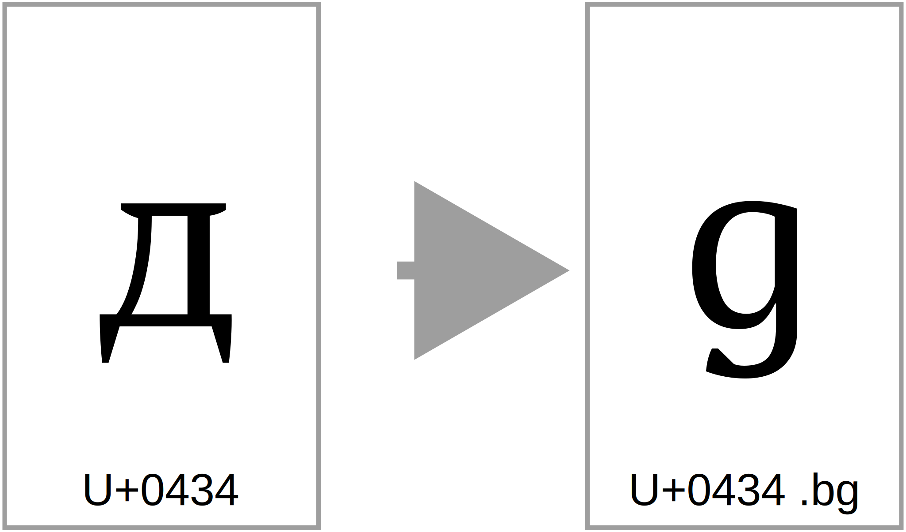 [txt](svg/variants/0434.bg.txt) | Bulgarian |
| 19 | 0434 | lowercase | sr | italic | localized | `&д.ita` |  [txt](svg/variants/0434.sr.txt) | Serbian |
| 20 | 0434 | lowercase | sr | straight | alternate | `+д.str` |  | Serbian |
| 21 | 0436 | lowercase | bg | any | alternate | `+ж` |  | Bulgarian |
| 22 | 0436 | lowercase | bg | any | localized | `&ж` | 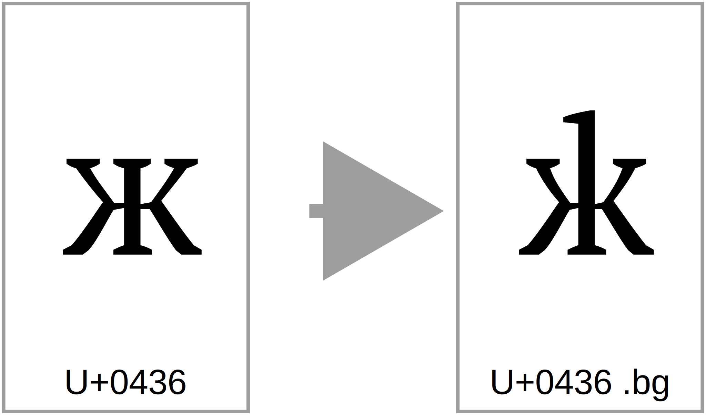 [txt](svg/variants/0436.bg.txt) | Bulgarian |
| 23 | 0437 | lowercase | bg | any | alternate | `+з` |  | Bulgarian |
| 24 | 0437 | lowercase | bg | any | localized | `&з` |  [txt](svg/variants/0437.bg.txt) | Bulgarian |
| 25 | 0438 | lowercase | bg | italic | alternate | `+и.ita` |  | Bulgarian |
| 26 | 0438 | lowercase | bg | straight | localized | `&и.str` |  [txt](svg/variants/0438.bg.txt) | Bulgarian |
| 27 | 0439 | lowercase | bg | italic | alternate | `+й.ita` |  | Bulgarian |
| 28 | 0439 | lowercase | bg | straight | localized | `&й.str` | 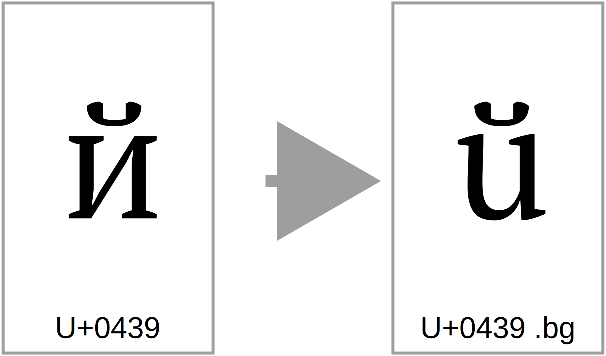 [txt](svg/variants/0439.bg.txt) | Bulgarian |
| 29 | 043A | lowercase | bg | any | alternate | `+к` |  | Bulgarian |
| 30 | 043A | lowercase | bg | any | localized | `&к` |  [txt](svg/variants/043A.bg.txt) | Bulgarian |
| 31 | 043B | lowercase | bg | any | alternate | `+л` |  | Bulgarian |
| 32 | 043B | lowercase | bg | any | localized | `&л` |  [txt](svg/variants/043B.bg.txt) | Bulgarian |
| 33 | 043D | lowercase | bg | italic | alternate | `+н.ita` |  | Bulgarian |
| 34 | 043D | lowercase | bg | straight | localized | `&н.str` | 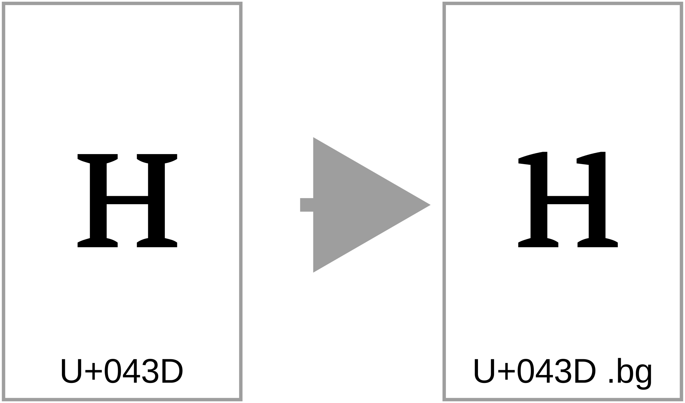 [txt](svg/variants/043D.bg.txt) | Bulgarian |
| 35 | 043F | lowercase | bg | italic | alternate | `+п.ita` |  | Bulgarian |
| 36 | 043F | lowercase | bg | straight | localized | `&п.str` | 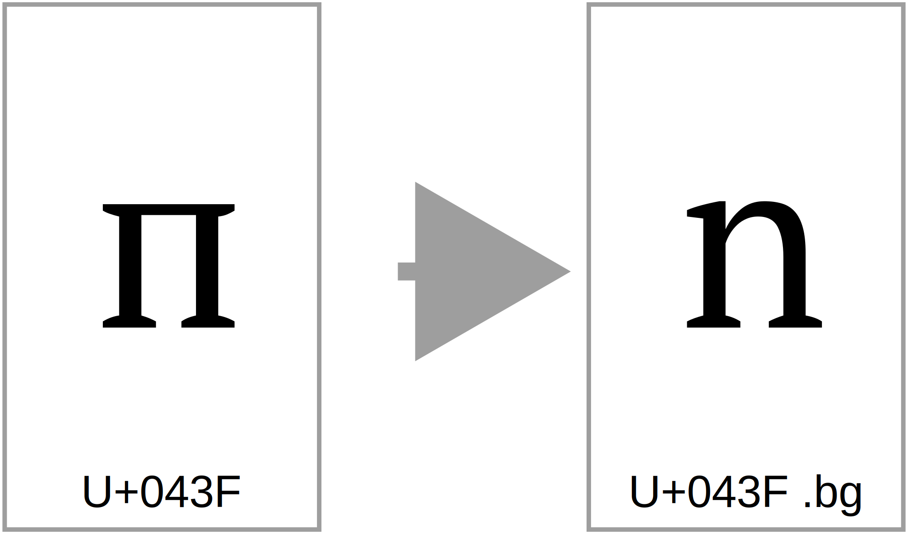 [txt](svg/variants/043F.bg.txt) | Bulgarian |
| 37 | 043F | lowercase | sr | italic | localized | `&п.ita` |  [txt](svg/variants/043F.sr.txt) | Serbian |
| 38 | 043F | lowercase | sr | straight | alternate | `+п.str` |  | Serbian |
| 39 | 0442 | lowercase | bg | italic | alternate | `+т.ita` |  | Bulgarian |
| 40 | 0442 | lowercase | bg | straight | localized | `&т.str` |  [txt](svg/variants/0442.bg.txt) | Bulgarian |
| 41 | 0442 | lowercase | sr | italic | localized | `&т.ita` | 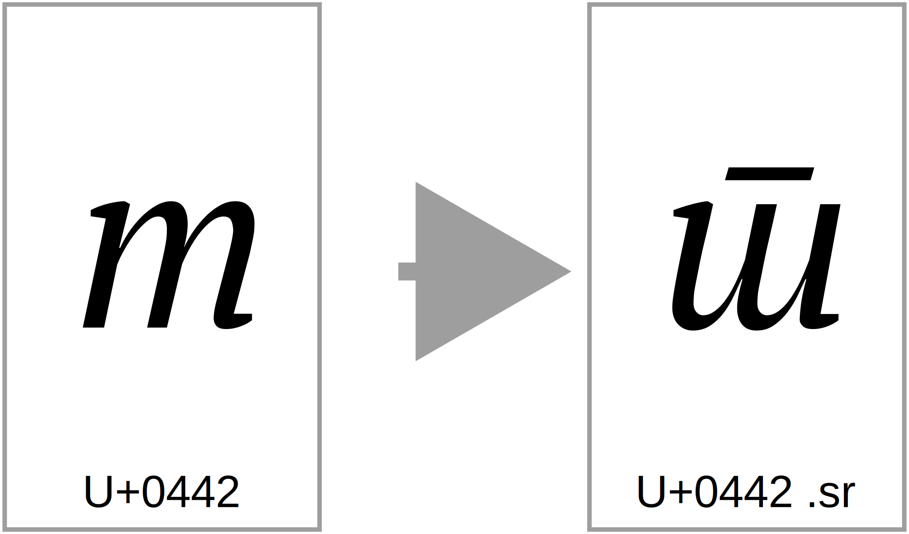 [txt](svg/variants/0442.sr.txt) | Serbian |
| 42 | 0442 | lowercase | sr | straight | alternate | `+т.str` |  | Serbian |
| 43 | 0446 | lowercase | bg | italic | alternate | `+ц.ita` |  | Bulgarian |
| 44 | 0446 | lowercase | bg | straight | localized | `&ц.str` | 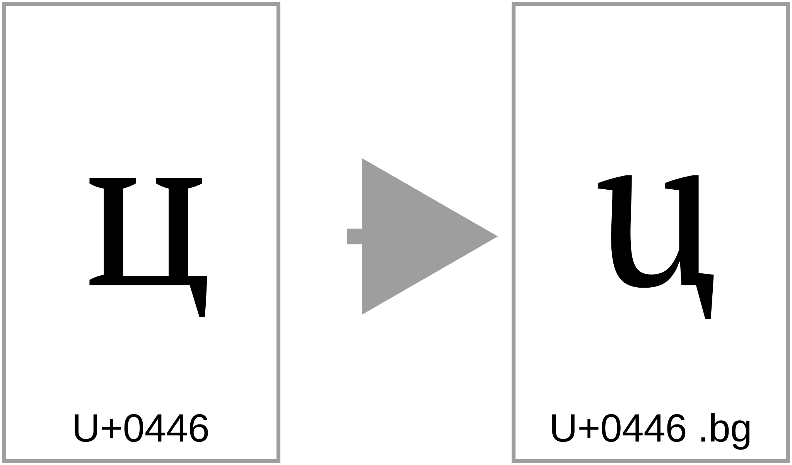 [txt](svg/variants/0446.bg.txt) | Bulgarian |
| 45 | 0447 | lowercase | bg | italic | alternate | `+ч.ita` |  | Bulgarian |
| 46 | 0447 | lowercase | bg | straight | localized | `&ч.str` | 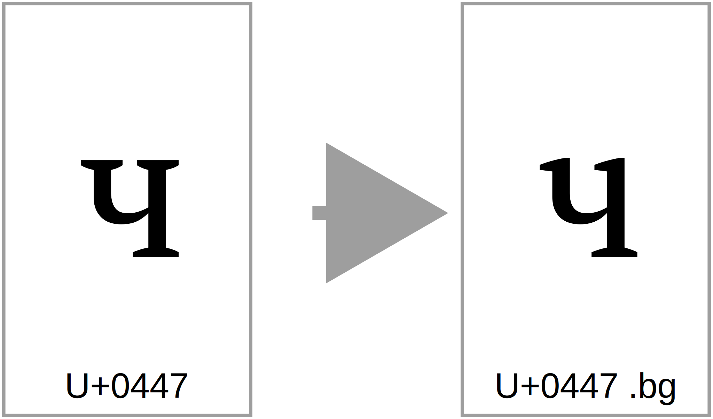 [txt](svg/variants/0447.bg.txt) | Bulgarian |
| 47 | 0448 | lowercase | bg | italic | alternate | `+ш.ita` |  | Bulgarian |
| 48 | 0448 | lowercase | bg | straight | localized | `&ш.str` | 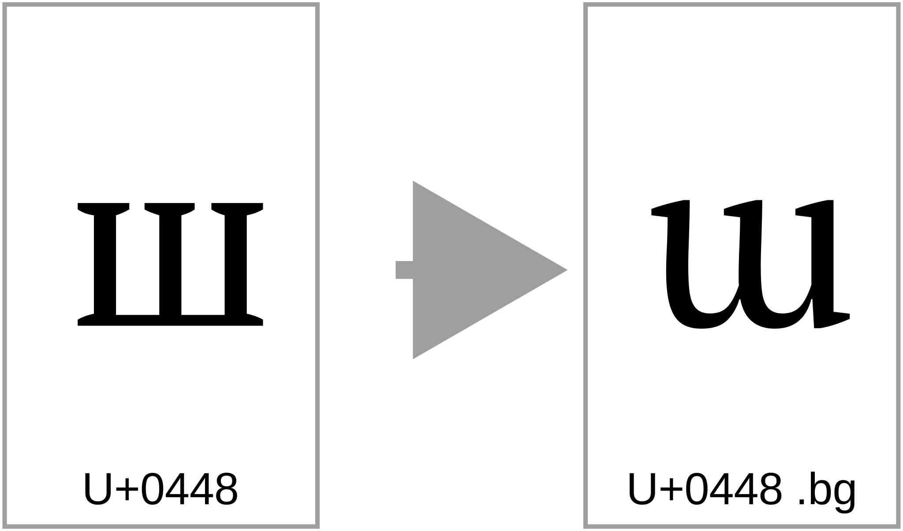 [txt](svg/variants/0448.bg.txt) | Bulgarian |
| 49 | 0448 | lowercase | sr | italic | localized | `&ш.ita` |  [txt](svg/variants/0448.sr.txt) | Serbian |
| 50 | 0448 | lowercase | sr | straight | alternate | `+ш.str` |  | Serbian |
| 51 | 0449 | lowercase | bg | italic | alternate | `+щ.ita` |  | Bulgarian |
| 52 | 0449 | lowercase | bg | straight | localized | `&щ.str` |  [txt](svg/variants/0449.bg.txt) | Bulgarian |
| 53 | 044A | lowercase | bg | italic | alternate | `+ъ.ita` |  | Bulgarian |
| 54 | 044A | lowercase | bg | straight | localized | `&ъ.str` |  [txt](svg/variants/044A.bg.txt) | Bulgarian |
| 55 | 044C | lowercase | bg | italic | alternate | `+ь.ita` |  | Bulgarian |
| 56 | 044C | lowercase | bg | straight | localized | `&ь.str` | 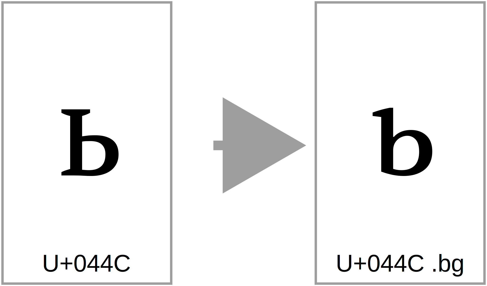 [txt](svg/variants/044C.bg.txt) | Bulgarian |
| 57 | 044E | lowercase | bg | any | alternate | `+ю` |  | Bulgarian |
| 58 | 044E | lowercase | bg | any | localized | `&ю` | 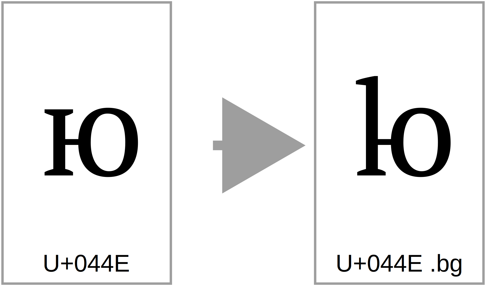 [txt](svg/variants/044E.bg.txt) | Bulgarian |
| 59 | 0463 | lowercase | bg | any | alternate | `+ѣ` |  | Bulgarian |
| 60 | 0463 | lowercase | bg | any | localized | `&ѣ` | 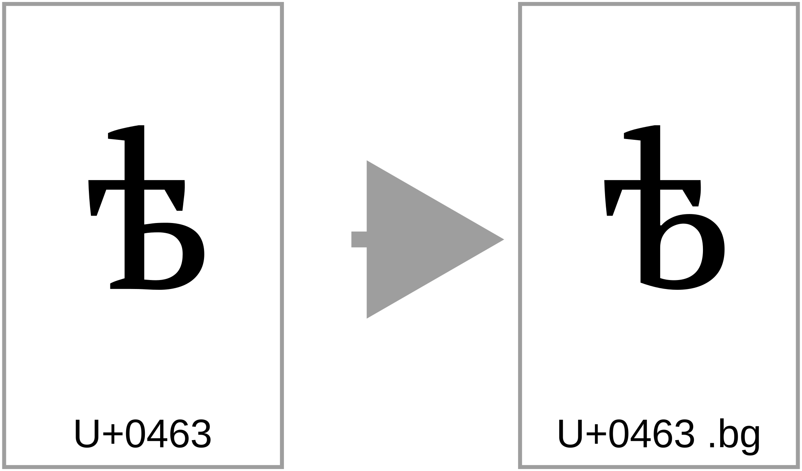 [txt](svg/variants/0463.bg.txt) | Bulgarian |
| 61 | 0465 | lowercase | bg | any | alternate | `+ѥ` |  | Bulgarian |
| 62 | 0465 | lowercase | bg | any | localized | `&ѥ` | 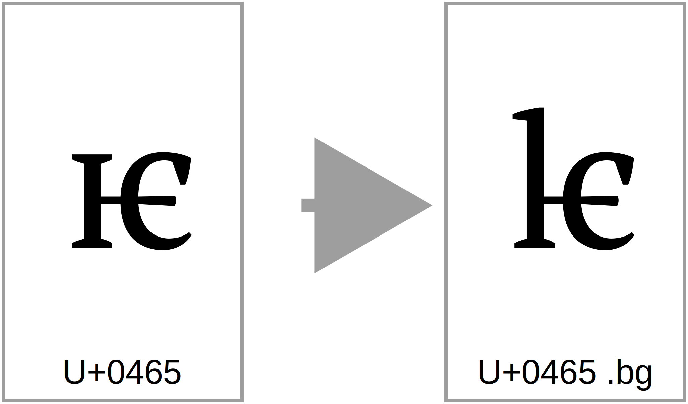 [txt](svg/variants/0465.bg.txt) | Bulgarian |
| 63 | 046D | lowercase | bg | any | alternate | `+ѭ` |  | Bulgarian |
| 64 | 046D | lowercase | bg | any | localized | `&ѭ` | 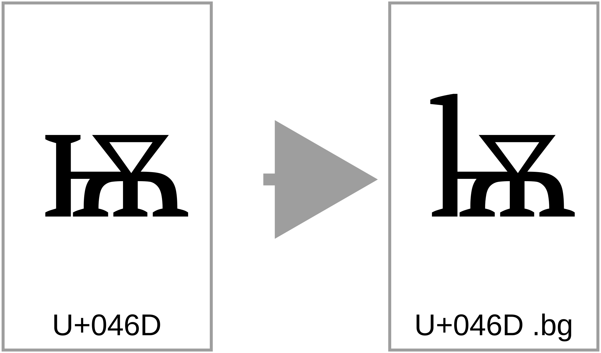 [txt](svg/variants/046D.bg.txt) | Bulgarian |
| 65 | 0492 | uppercase | ba | any | alternate | `+Ғ` |  | Bashkir |
| 66 | 0493 | lowercase | ba | any | alternate | `+ғ` |  | Bashkir |
| 67 | 0498 | uppercase | ba | any | alternate | `+Ҙ` |  | Bashkir |
| 68 | 0499 | lowercase | ba | any | alternate | `+ҙ` |  | Bashkir |
| 69 | 04AA | uppercase | ba | any | alternate | `+Ҫ` |  | Bashkir |
| 70 | 04AA | uppercase | cv | any | alternate | `+Ҫ` |  | Chuvash |
| 71 | 04AB | lowercase | ba | any | alternate | `+ҫ` |  | Bashkir |
| 72 | 04AB | lowercase | cv | any | alternate | `+ҫ` |  | Chuvash |
| 73 | A657 | lowercase | bg | any | alternate | `+ꙗ` |  | Bulgarian |
| 74 | A657 | lowercase | bg | any | localized | `&ꙗ` | 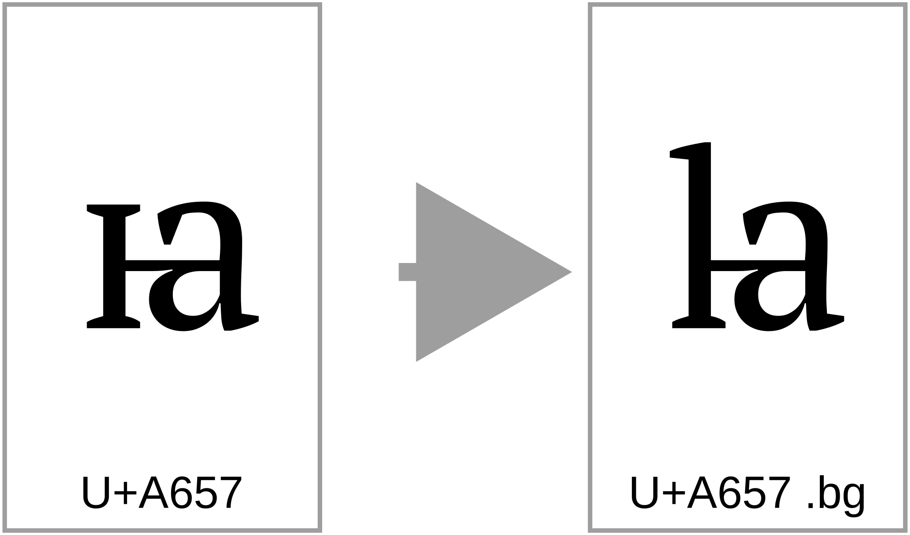 [txt](svg/variants/A657.bg.txt) | Bulgarian |
| 75 | F50A | uppercase | ba | any | localized | `&!F50A` |  [txt](svg/variants/F50A.ba.txt) | Bashkir |
| 76 | F50B | lowercase | ba | any | localized | `&!F50B` | 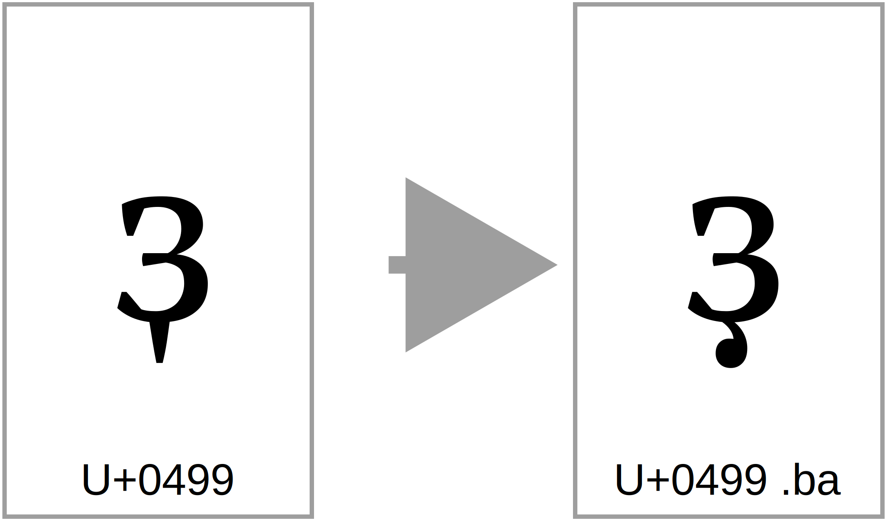 [txt](svg/variants/F50B.ba.txt) | Bashkir |
| 77 | F50C | uppercase | cv | any | localized | `&!F50C` | 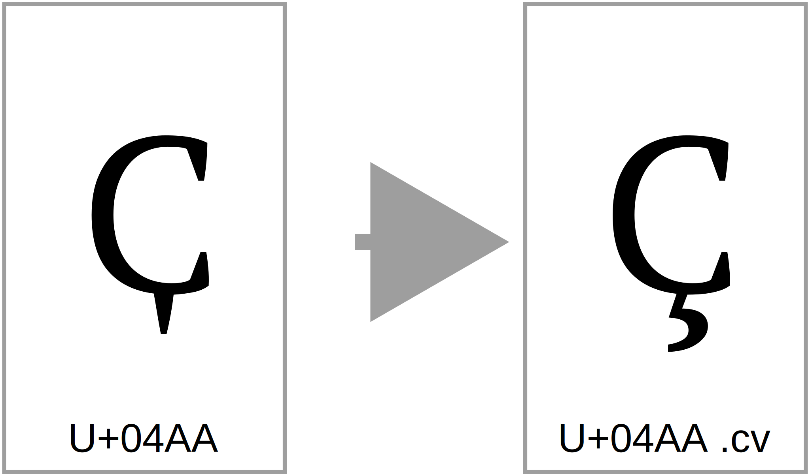 [txt](svg/variants/F50C.cv.txt) | Chuvash |
| 78 | F50D | lowercase | cv | any | localized | `&!F50D` | 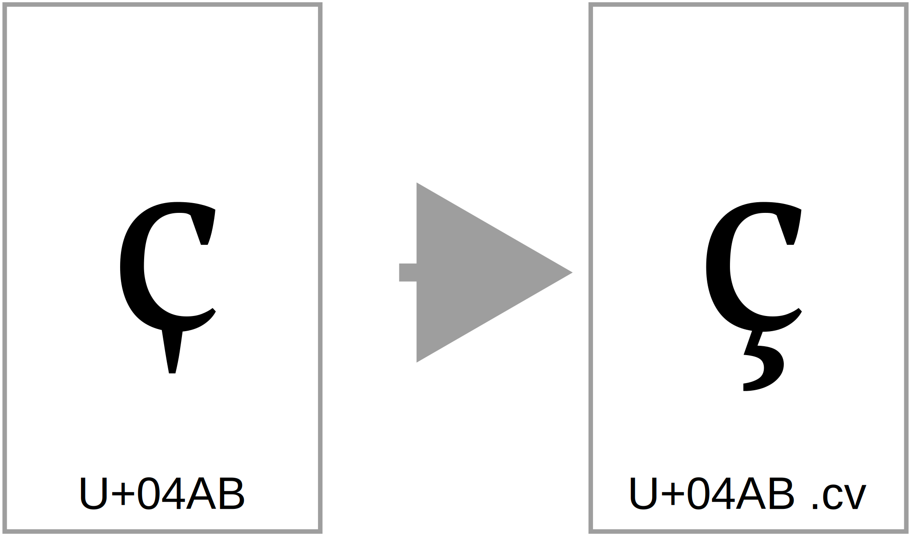 [txt](svg/variants/F50D.cv.txt) | Chuvash |
| 79 | F53C | uppercase | ba | any | localized | `&!F53C` |  [txt](svg/variants/F53C.ba.txt) | Bashkir |
| 80 | F53D | lowercase | ba | any | localized | `&!F53D` | 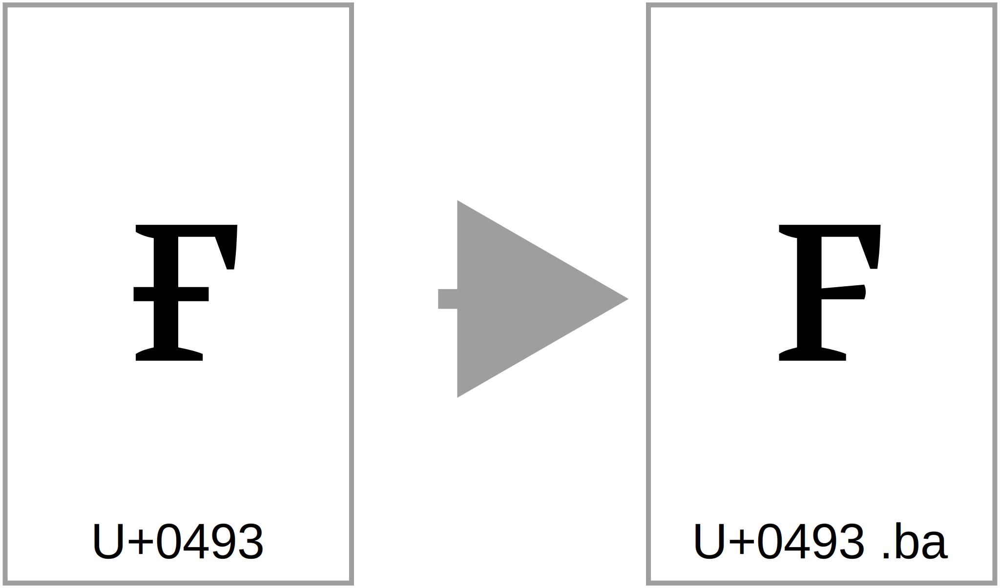 [txt](svg/variants/F53D.ba.txt) | Bashkir |
| 81 | F53E | uppercase | ba | any | localized | `&!F53E` |  [txt](svg/variants/F53E.ba.txt) | Bashkir |
| 82 | F53F | lowercase | ba | any | localized | `&!F53F` | 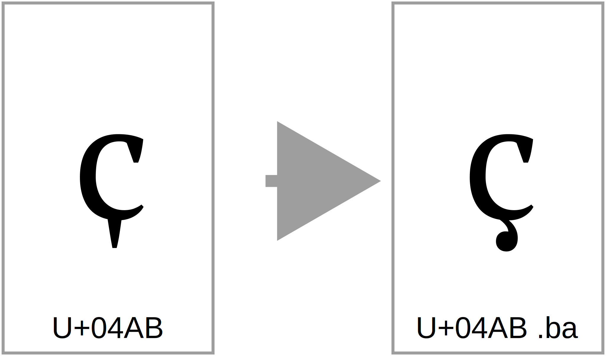 [txt](svg/variants/F53F.ba.txt) | Bashkir |
